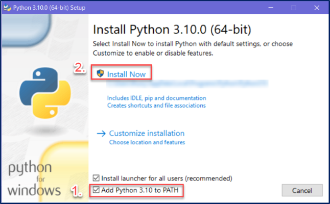

# Technologies Used

The following technologies are used throughout this text.

## Programming Language

We will be using Python as our programming language for this course. Specifically we will be using Python 3.12 or later (3.1X).

```{admonition} I already have Python
:class: caution
You may laready have Python installed on your computer. This may be from a previous course, or macOS sometimes comes packaged with Python 2.7 (don't not use this or remove it, it is part of your operating system).

Irrespective, is it best that you install and use the latest version of Python. This will provide you with access to all the features described in this course and ensure that you are using the fastest and most secure version of the language.

You can have more than one version on Python on you computer, so follow the instructions below to ensure you have the latest version.
```

### Windows users

Windows users can install Python via the official Python website or via the Microsoft Store.

#### Microsoft store

The Microsoft Store offers two advantages:

1. Python will automatically be added to the **<a href="https://www.maketecheasier.com/what-is-the-windows-path/" target="_blank">PATH variable</a>**.
2. Windows will automatically update minor release of Python. For example
   - it will update 3.12.0 &rarr; 3.12.1
   - it **won't** update 3.12.0 &rarr; 3.13

To install via the Microsoft Store:

1. Open the Microsoft Store on Windows
2. Search for Python 3.12 and select it
3. Click the **Get** button in the top right-hand corner

#### Official website

To install Python go to the **<a href="https://www.python.org/downloads/" target="_blank">downloads section of the Python website</a>** and choose the installer for your OS.

```{admonition} Important step for Windows users
:class: danger
<font color=red>**Really important for Windows users (hence the red):** You need to make sure that you check the box beside **Add Python 3.1X to PATH**. Failure to do this will hamper the use of Python on Windows, and when you have a problem, I will just tell you to reinstall it using the instructions that you should have used the first time.</font>

<font color=red>Follow the steps below:</font>


```

### Mac Users

To install Python go to the **<a href="https://www.python.org/downloads/" target="_blank">downloads section of the Python website</a>** and choose the installer for your OS.

### Packages

Python comes installed with a range of packages. This is called **<a href="https://docs.python.org/3/library/" target="_blank">The Python Standard Library</a>**. Although these might seem like a huge number of packages, it is actually a very small selection of packages available. These cover Python's basic operations, and limiting the install to these packages reduces the size of Python.

To extend the functionality of Python, you need to install additional packages. These packages can be found at the **<a href="https://pypi.org/" target="_blank">Python Package Index</a>**. Some of the packages we will use are:

- **<a href="https://pypi.org/project/PyQt6/" target="_blank">PyQt6</a>**
- **<a href="https://pypi.org/project/requests/" target="_blank">Requests</a>**

To install the packages, we will be using Python's built-in package installer `pip`.

### Virtual Environments

The modular nature of Pythons means that different projects will require different packages. Over time this can lead to dependency conflicts and your Python install will become bloated. To prevent this we use **virtual environments**.

```{admonition} Dependancy Conflict
:class: tip
Modules in Python are built using other modules, these are called **dependencies**. It is not unusual for two different modules share a dependancy, but this can present a problem when the two modules require different versions of the shared dependancy. Which version of the shared dependancy should be installed? This is called a dependancy conflict.
```

At its core, the main purpose of Python virtual environments is to create an isolated version of Python for a specific project. This means that each project can have its own packages, regardless of what packages every other project has. The great thing about this is that there are no limits to the number of environments you can have since they're just directories containing a different scripts.

---

## Integrated Development Environment

Since Python script files are just text files, you can write Python code in Windows Notepad, or TextEdit on macOS, and this might work for small projects. Once your project starts involving several modules, each with hundreds of lines, it starts becoming unwieldy. This is where an IDE (Integrated Development Environment) or a Code Editor are useful.

An IDE (or Integrated Development Environment) is a program dedicated to software development. As the name implies, IDEs integrate several tools specifically designed for software development. These tools usually include:

- An editor designed to handle code (with, for example, syntax highlighting and auto-completion)
- Build, execution, and debugging tools
- Some form of source control

In contrast, a dedicated code editor can be as simple as a text editor with syntax highlighting and code formatting capabilities. Most good code editors can execute code and control a debugger. The very best ones interact with source control systems as well. Compared to an IDE, a good dedicated code editor is usually smaller and quicker, but often less feature rich.

We will be using Visual Studio Code (VS Code) (**<a href="https://code.visualstudio.com/" target="_blank">download from here</a>**) which is a code editor, although, we will use a range extensions to expand its capability so that is it equivalent to  an IDE.

Importantly, the extended VS Code will allows us to:

- **Save and reload code files** - allows you to save your work and reopen everything later, in the same state it was in when you left.
- **Run code from within the environment** - you can run Python code without having to drop out of the editor.
- **Debugging support** - allow you to step through your code as it runs, displaying variable values etc.
- **Syntax highlighting** - uses font colours to help you quickly spot keywords, variables, and symbols in your code. This makes reading and understanding code much easier.
- **Automatic code formatting** - little things like recognizing the colon at the end of a while or for statement, and indenting the next line, makes life easier.

### Extensions

We will be using the below extensions in VS Code to expand it's capabilities:

- **<a href="https://marketplace.visualstudio.com/items?itemName=ms-python.python" target="_blank">Python</a>**
- **<a href="https://marketplace.visualstudio.com/items?itemName=ms-python.vscode-pylance" target="_blank">Pylance</a>**
- **<a href="https://marketplace.visualstudio.com/items?itemName=VisualStudioExptTeam.vscodeintellicode" target="_blank">Visual Studio IntelliCode</a>**
- **<a href="https://marketplace.visualstudio.com/items?itemName=seanwu.vscode-qt-for-python" target="_blank">Qt for Python</a>**
- **<a href="https://marketplace.visualstudio.com/items?itemName=sourcery.sourcery" target="_blank">Sourcery</a>**
- **<a href="https://marketplace.visualstudio.com/items?itemName=ms-python.black-formatter" target="_blank">Black Formatter</a>**
- **<a href="https://marketplace.visualstudio.com/items?itemName=alexcvzz.vscode-sqlite" target="_blank">SQLite</a>**
- **<a href="https://marketplace.visualstudio.com/items?itemName=mechatroner.rainbow-csv" target="_blank">Rainbow CSV</a>**

You can also install various icon and colour themes. For this course I will be using the extensions below, but you can use whatever you like.

- **<a href="https://marketplace.visualstudio.com/items?itemName=ghgofort.neon-vommit" target="_blank">Neon Vomit Colour Theme</a>**
- **<a href="https://marketplace.visualstudio.com/items?itemName=PKief.material-icon-theme" target="_blank">Material Icon Theme</a>**

---
## Version Control

Version control, also known as source control, is the practice of tracking and managing changes to software code. Version control systems are software tools that help software teams manage changes to source code over time.

### Git

Git is a free and open source distributed version control system designed to handle everything from small to very large projects with speed and efficiency. Git is naturally incorporated into VS Code, but you will need to **<a href="https://git-scm.com/downloads" target="_blank">download and install the Git client</a>** for it to work properly.

### Github

**<a href="https://github.com/" target="_blank">GitHub</a>** is a provider of internet hosting for software development and version control using Git. It offers the distributed version control and source code management (SCM) functionality of Git, plus its own features. It provides access control and several collaboration features such as bug tracking, feature requests, task management, continuous integration and wikis for every project. It is commonly used to host open-source projects. As of November 2021, GitHub reports having over 73 million developers and more than 200 million repositories (including at least 28 million public repositories).

We will be using GitHub to host your code for this course. If you don't already have an account, got to **<a href="https://github.com/" target="_blank">GitHub</a>** and register. Use your College email to register. You can change the email if you wish to use the account after school to access your code from this course.

To make working with GitHub easier, we will also be using **<a href="https://desktop.github.com/" target="_blank">GitHub Desktop</a>** which is a GUI interface for working with GitHub. It makes using GitHub significantly easier.

---

## Database Management System

Database Management Systems (DBMS) are software systems used to store, retrieve, and run queries on data. A DBMS serves as an interface between an end-user and a database, allowing users to create, read, update, and delete data in the database. 

In Unit 2 we will working with databases using SQL (Structured Query Language), in particular a version caller SQLite. Ultimately in Unit 3 we will designing and developing our own DBMS, but for Unit 2 we will use a lightweight DBMS called **<a href="https://sqlitebrowser.org/" target="_blank">DB Browser for SQLite</a>**.

---

## Other Tools

(xmind_install)=
### XMind

An important step in analysing and planning in Digital Solutions is using mind maps. There are many mind mapping tools available, both desktop and online, but I recommend that we use **<a href="https://xmind.app/" target="_blank">Xmind</a>**. The free version has all the features we need. **When it asks you to create an account, choose the skip option**.

### Diagrams dot net

Throughout the course you will need to create a range of diagrams. To do this we will use diagrams dot net. You can use the **<a href="https://www.diagrams.net/" target="_blank">online version</a>**, or you can download the **<a href="http://get.diagrams.net/" target="_blank">desktop version</a>**. I personally use the desktop version to save my diagrams straight to my project folders.

### Adobe XD

We will be using Adobe XD to create wireframes, mockups, prototypes, and application interface flowcharts. To install Adobe XD you need to **<a href="https://creativecloud.adobe.com/en/apps/download/creative-cloud" target="_blank">download and install Creative Cloud</a>**, log in using your school account and then choose to install Adobe XD.

### Qt Designer

**<a href="https://build-system.fman.io/qt-designer-download" target="_blank">Qt Designer</a>** is a tool for quickly building graphical user interfaces with widgets from the Qt GUI framework. It gives you a simple drag-and-drop interface for laying out components such as buttons, text fields, combo boxes and more. We will be using it throughout the course.