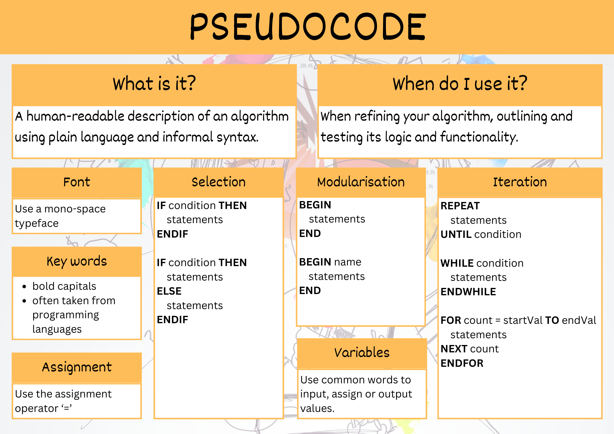

# Pseudocode


Pseudocode is a technique used to describe the distinct steps of an algorithm in a manner that is easy to understand for anyone with basic programming knowledge.

Although pseudocode is a syntax-free description of an algorithm, it must provide a full description of the algorithm’s logic so that moving from it to implementation should be merely a task of translating each line into code using the syntax of any programming language.

Advantages of pseudocode:

- **Better readability** - Often, programmers work alongside people from other domains, such as mathematicians, business partners, managers, and so on. Using pseudocode to explain the mechanics of the code will make the communication between the different backgrounds easier and more efficient.
- **Ease up code construction** - When the programmer goes through the process of developing and generating pseudocode, the process of converting that into real code written in any programming language will become much easier and faster as well.
- **A good middle point between flowchart and code** - Moving directly from the idea to the flowchart to the code is not always a smooth ride. That’s where pseudocode presents a way to make the transition between the different stages somewhat smoother.
- **Act as a start point for documentation** - Documentation is an essential aspect of building a good project. Often, starting documentation is the most difficult part. However, pseudocode can represent a good starting point for what the documentation should include. Sometimes, programmers include the pseudocode as a docstring at the beginning of the code file.
- **Easier bug detection and fixing** - Since pseudocode is written in a human-readable format, it is easier to edit and discover bugs before actually writing a single line of code. Editing pseudocode can be done more efficiently than testing, debugging, and fixing actual code.

## QCAA Pseudocode Rules

In Digital Solutions, pseudocode has an additional purpose. The Digital Solutions Syllabus allows for a range of programming languages to be used. With different languages being used in schools across Queensland, pseudocode is used as the formal method of representing algorithms in Digital Solutions. In that capacity, QCAA has established very specific rules around for its use.

### Keywords

**KEYWORDS** should be written bold and capitalized.

Keywords do not have to be valid programming language words as long as they clearly convey the intent of the line of pseudocode.

### Calculations

Pseudocode should clearly indicate what is happening at each step, including formulas of calculations.

For example:
`CALCULATE net` is not as clear as `CALCULATE net = gross − tax`

### Naming Conventions

Use snake case naming convention for variable names with multiple words, subroutines, methods and functions.

Snake case is a convention where all words are in lowercase and spaces between words is replaces with an `_`

For example:
`VAR file_name`

### Font

Use a mono-space typeface when writing algorithms on computer:

Windows mono-space fonts:

- Courier New
- Consolas
- Cascadia Code
- Cascadia Mono

Mac mono-spaced fonts:

- Andalé Mono
- Consolas
- Courier
- Courier New

### Variables

To input or output values, common words can be used as keywords.

For example:

- `INPUT mark`
- `WRITE "the total is" count`
- `PRINT x, y`
- `DISPLAY name, result`
- `READ name from list.txt`
- `OUTPUT average`

Pseudocode uses the assignment operator, `=` to assign values.

For example:

- `CALCULATE net = gross - tax`

### Modularisation

All pseudocode modules start and ends with the `BEGIN` and `END` keywords.

Main algorithm:

``` pseudocode
BEGIN
    statements
END
```

Defining procedures, subroutines, methods or functions

``` pseudocode
BEGIN function_name
    statements
END
```

Calling procedures, subroutines, methods or functions

``` pseudocode
statements
function_name
statements
```

### Iterations

There are three main types of loops — each has a clear start and end, with the statements within the loop indented.

#### Post-test loops

``` pseudocode
REPEAT
    statements
UNTIL
```

**Note:** Python does not have a Post-test loop, so we will not be using this for units 1-3. But you need to know about this concept for Unit 4, particularly for the external exam.

#### Pre-test loop

``` pseudocode
WHILE
    statements
ENDWHILE
```

#### Counted loop

``` pseudocode
FOR count = start_val TO end_val
    statements
NEXT count
ENDFOR
```

### Selection

A control structure used for decisions or branching and choosing alternate paths. The beginning and end of these structures are indicated with keywords.

#### IF statement

``` pseudocode
IF condition THEN
    statements
ENDIF
```

#### IF...ELSE statement

``` pseudocode
IF condition THEN
    statements
ELSE
    statements
ENDIF
```

#### IF...ELIF...ELSE statement

``` pseudocode
IF condition THEN
    statements
ELSE IF condition THEN
    statements
ELSE
    statements
ENDIF
```

#### MATCH statement

In most other languages these are called switches

``` pseudocode
SWITCH test_variable
    CASE option
        statements
    CASE option
        statements
    CASE statements
ENDSWITCH
```



```{admonition} Unit 1 subject matter covered:
- Represent algorithms using pseudocode by identifying and describing the steps and their behaviour in the algorithm
- Represent algorithms using pseudocode by identifying and explaining the algorithmic steps required for a programmed solution
{cite}`queenslandcurriculumassessmentauthority_2017_digital`
```

```{admonition} Unit 2 subject matter covered:
- Symbolise algorithmic steps as pseudocode
- Symbolise well-ordered and unambiguous algorithms using pseudocode for procedural code that processes data for insertion into a database or manipulates or displays retrieved data
- Symbolise well-ordered and unambiguous algorithms using pseudocode for user interaction, data validation and data presentation
{cite}`queenslandcurriculumassessmentauthority_2017_digital`
```

```{admonition} Unit 3 subject matter covered:
- Recognise and use appropriate pseudocode conventions
- Symbolise well-ordered and unambiguous algorithms using pseudocode for procedural code that processes data for insertion into a database or manipulates or displays retrieved data
- Symbolise well-ordered and unambiguous algorithms using pseudocode for user interaction, data validation and data presentation
{cite}`queenslandcurriculumassessmentauthority_2017_digital`
```

```{admonition} Unit 4 subject matter covered:
- Symbolise algorithmic steps as pseudocode
{cite}`queenslandcurriculumassessmentauthority_2017_digital`
```