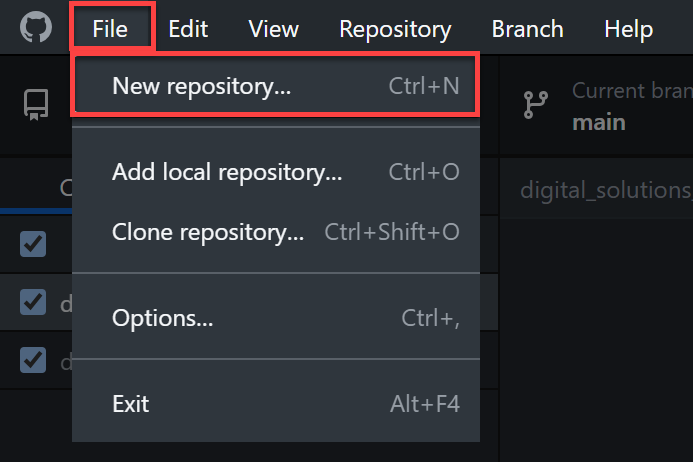
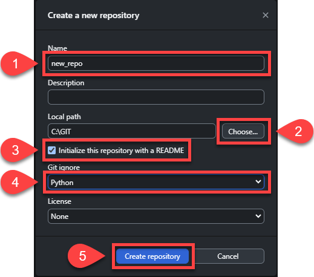
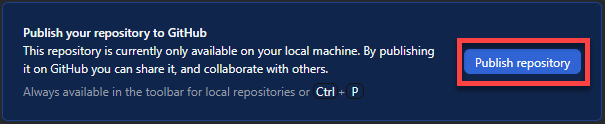
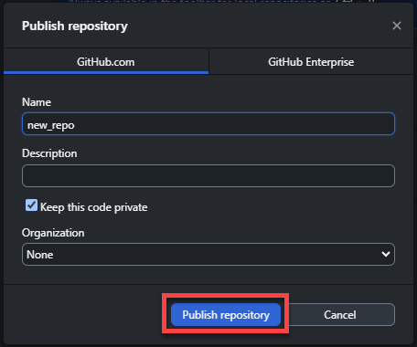
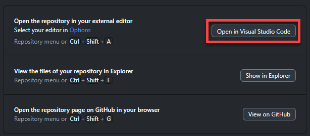
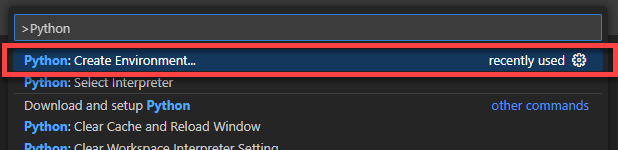
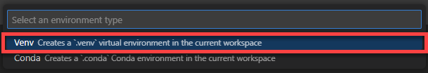
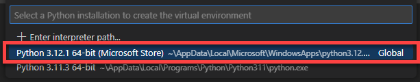
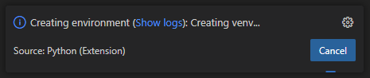

# Development Environment

Below is the workflow we will be using to create new development environments. 

```{admonition} Workflows
:class: tip
Development environments are as unique as each developer. You will develop your own workflows are your programming experience grows. But for now, follow these steps to ensure that your development environment is set up correctly.
```

## Creating the development environment

### Create repository in GitHub Desktop

The first step in creating your development environment is creating the GitHub repo for your project.

1. Open GitHub Desktop
2. Choose **File** &rarr; **New repository**



3. Fill in the **Create a new repository** dialogue box
   1. Add an appropriate name
   2. Choose the location on you computer to save the repo
   3. Check the **Initialize this repository with a README**
   4. Choose **Python** as the **Git Ignore** configuration
   5. Click **Create repository**



4. Click **Publish repository**



5. Click **Publish repository**



6. Click **Open in Visual Studio Code**



### Create virtual environment in VS Code

1. Open command panel
   - Windows &rarr; `ctrl` + `shift` + `P`
   - macOS &rarr; `cmd` + `shift` + `P`
2. Type `Python` then select **Python: Create Environment...**



3. Click the **Venv** option



4. Choose the newest version of Python



5. Wait for environment to be created

