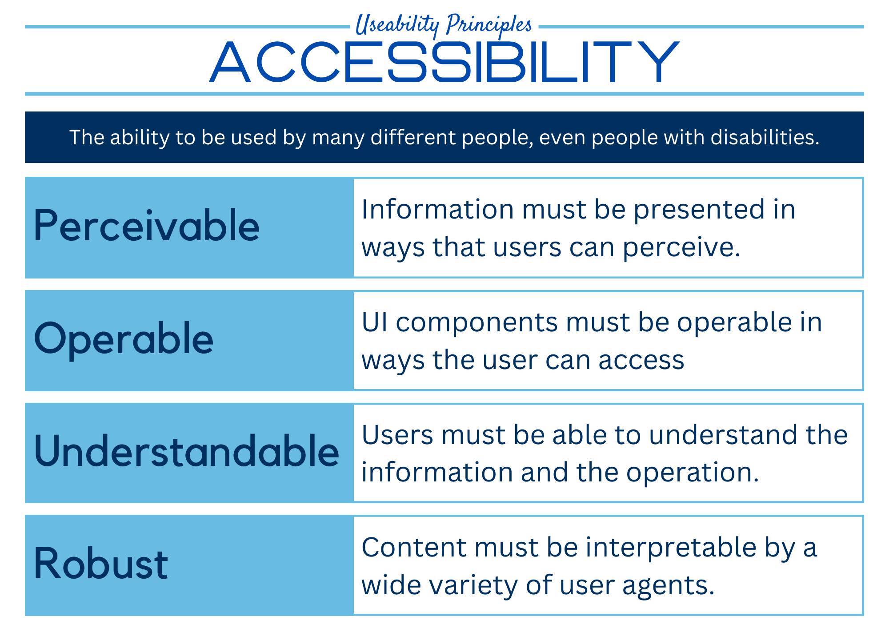
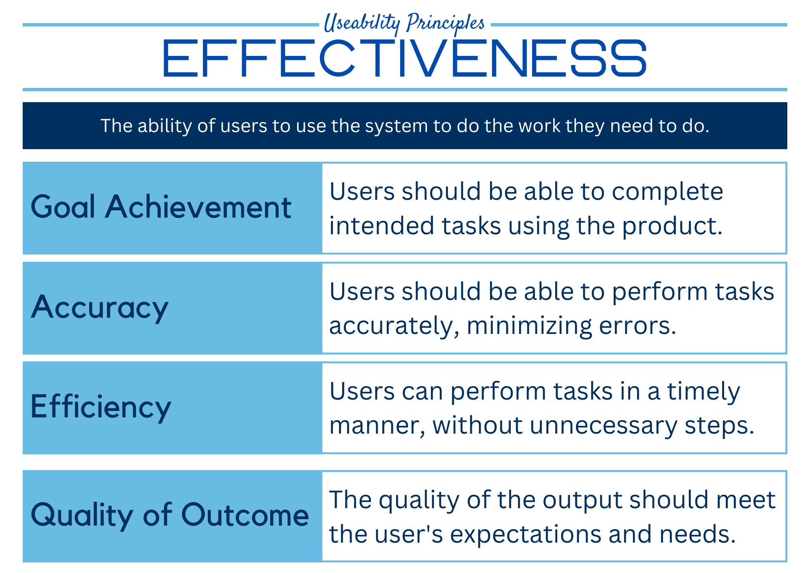
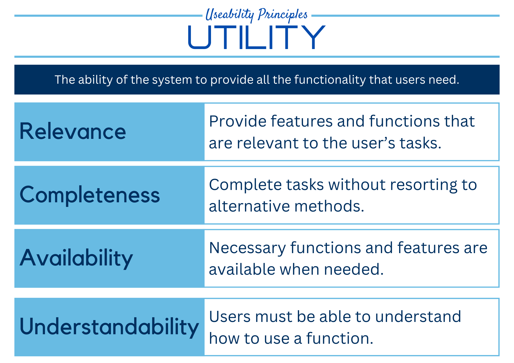
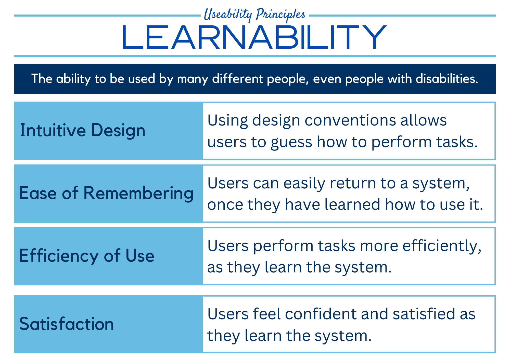

# Useability Principles

## Accessibility



## Effectiveness



## Safety


## Utility




## Learnability




```{admonition} Unit 1 subject matter covered:
- Recognise and describe useability principles including accessibility, effectiveness, safety, utility and learnability
{cite}`queenslandcurriculumassessmentauthority_2017_digital`
```

```{admonition} Unit 2 subject matter covered:
- Recognise and describe useability principles including accessibility, effectiveness, safety, utility and learnability
{cite}`queenslandcurriculumassessmentauthority_2017_digital`
```