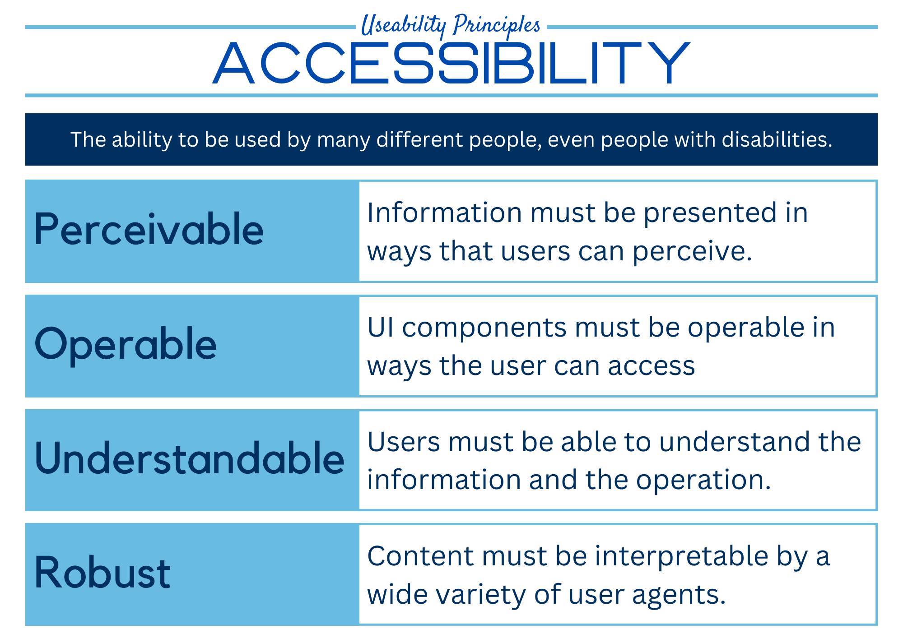
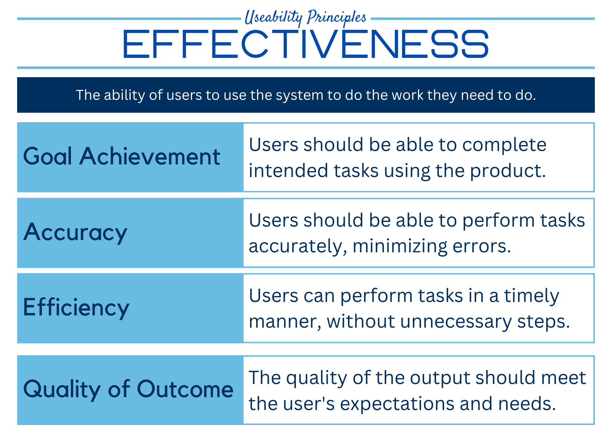
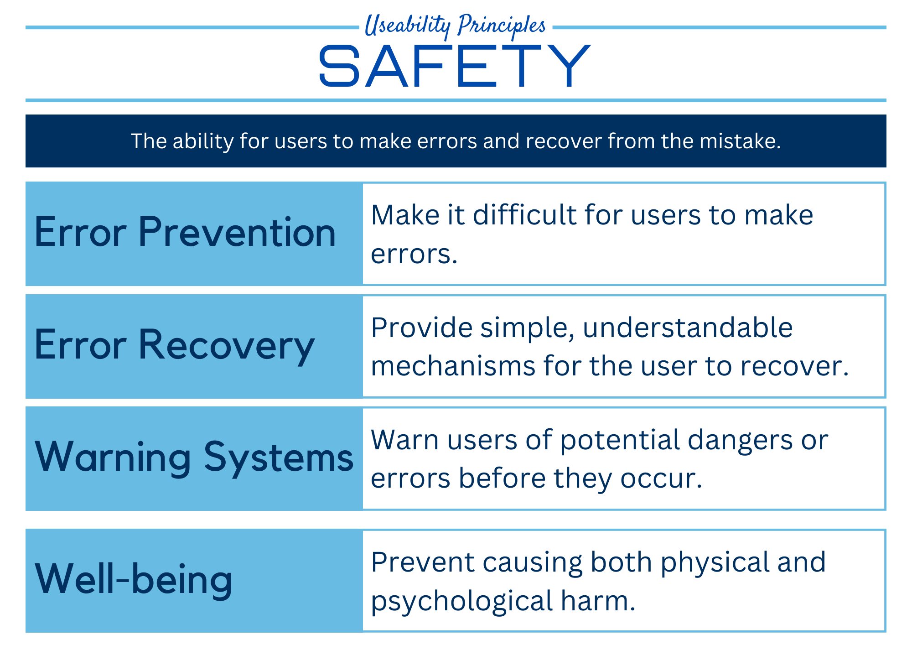
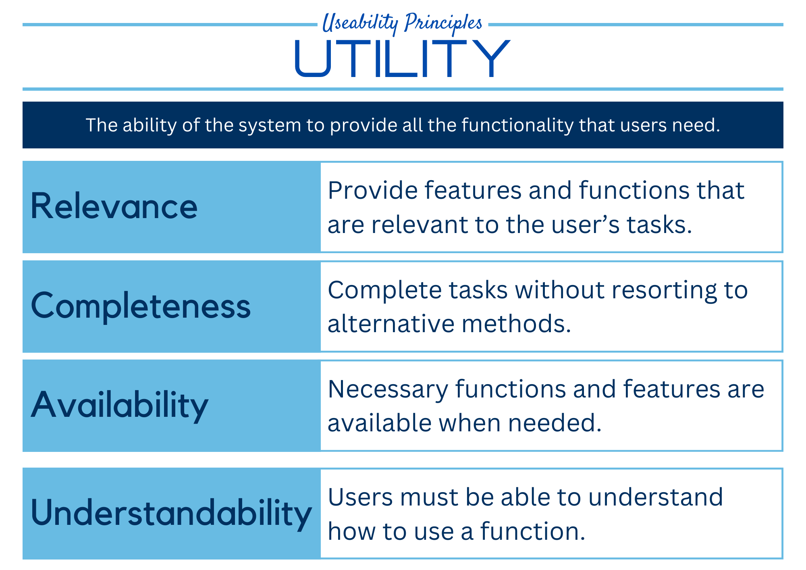

# Useability Principles

## Accessibility

### Accessibility Summary



## Effectiveness

### Effectiveness Summary



## Safety

### Safety Summary



## Utility

### Utility Summary




## Learnability


```{admonition} Unit 1 subject matter covered:
- Recognise and describe useability principles including accessibility, effectiveness, safety, utility and learnability
{cite}`queenslandcurriculumassessmentauthority_2017_digital`
```

```{admonition} Unit 2 subject matter covered:
- Recognise and describe useability principles including accessibility, effectiveness, safety, utility and learnability
{cite}`queenslandcurriculumassessmentauthority_2017_digital`
```