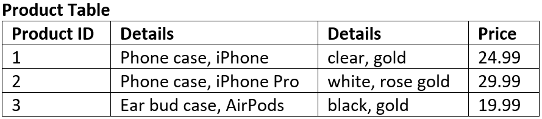
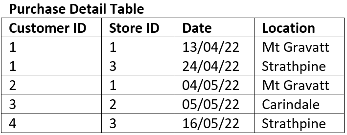
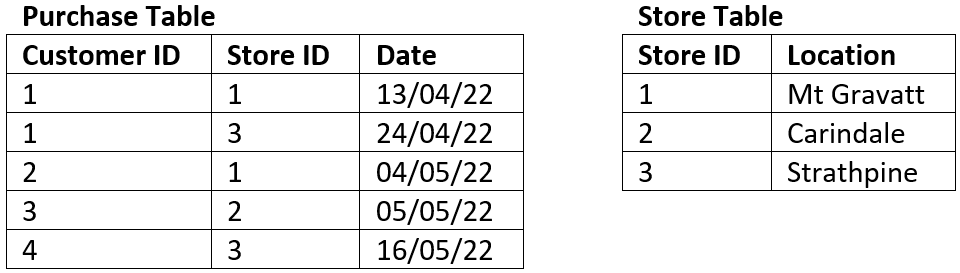

# Structuring Data

## Flat File Databases

A flat file database is a type of database that stores data in a simple, two-dimensional table or spreadsheet-like structure. In a flat file database, information is organized into **rows** and **columns**, where each row represents a single **record** or entry, and each column represents a specific attribute or **field** of that record.

Unlike more complex relational databases, flat file databases do not have multiple tables with predefined relationships between them. Instead, all data is stored in a single file, making it easy to create and manage but limited in terms of its ability to handle complex data relationships. 

Flat file databases are often used for relatively small-scale data storage needs, such as simple lists, address books, or basic inventory records. They are easy to create and understand but may not be suitable for more complex and data-intensive applications.

## Relational Databases

<iframe width="560" height="315" src="https://www.youtube-nocookie.com/embed/oN3jBRGnPO4?si=DIvn1x_PiI9s69Fd" title="YouTube video player" frameborder="0" allow="accelerometer; autoplay; clipboard-write; encrypted-media; gyroscope; picture-in-picture; web-share" allowfullscreen></iframe>

A relational database is a type of database that organizes and stores data in a structured manner, using a collection of tables with predefined relationships between them. It is based on the principles of relational algebra and was introduced by Edgar F. Codd in the 1970s.

In a relational database, data is organized into **tables**, where each table represents a specific **entity** or **concept**, and each **row** in the table represents a unique record or instance of that entity. **Columns** in the table represent attributes or characteristics of the entity.

The key features of relational databases include:

1. **Tables**: Data is stored in tables with **rows** and **columns**, providing a clear structure for organizing information.
2. **Relationships**: Tables can be **related** to each other through common (shared) fields called **keys**, allowing for complex queries and the retrieval of related data.
3. **Integrity**: Relational databases enforce data integrity through **constraints**, ensuring that data remains **accurate** and **consistent**.
4. **SQL (Structured Query Language)**: Relational databases use SQL for **querying** and **manipulating** data, making it a powerful tool for working with databases.
5. **ACID Properties**: Relational databases adhere to ACID properties, which guarantee the reliability of data transactions:
   - **Atomicity**:
      - Atomicity treats a database transaction as an all-or-nothing operation.
      - It ensures that either the entire transaction is successfully completed, and its changes are applied, or none of it happens.
      - If any part of a transaction fails, the entire transaction is rolled back, ensuring data consistency.
   - **Consistency**:
      - Consistency ensures that a transaction transforms the database from one valid state to another valid state.- It prevents transactions from violating the integrity rules defined in the database schema.
      - If a transaction would break these rules, it is halted, and the database remains unchanged.
   - **Isolation**:
      - Isolation guarantees that concurrent transactions do not interfere with each other.
      - Each transaction runs as if it's the only one, preventing issues like data conflicts caused by simultaneous access.
      - Different isolation levels determine the degree of separation between transactions.
   - **Durability**:
      - Durability ensures that once a transaction is committed, its changes are permanent and survive system failures.
      - Committed data is stored in non-volatile memory (usually on disk) for recovery even in the event of a system crash.
      - Durability ensures data remains reliable and persistent over time.

Relational databases are widely used in various applications, from business systems to web applications, due to their ability to handle structured data and complex relationships efficiently. Popular relational database management systems (RDBMS) include MySQL, PostgreSQL, Oracle, SQL Server, and SQLite.

### Normalisation

> Normalization is a database design technique that reduces data redundancy and eliminates undesirable characteristics like Insertion, Update and Deletion Anomalies. Normalization rules divides larger tables into smaller tables and links them using relationships. The purpose of Normalisation ... is to eliminate redundant (repetitive) data and ensure data is stored logically. {cite}`richardpeterson_2019_what`

<iframe width="560" height="315" src="https://www.youtube.com/embed/xoTyrdT9SZI" title="YouTube video player" frameborder="0" allow="accelerometer; autoplay; clipboard-write; encrypted-media; gyroscope; picture-in-picture" allowfullscreen></iframe>

Data redundancy is undesirable because it results in:

- Increased database size
- Erosion of data integrity through:
  - **Insertion anomalies**
    - the need to repeat data when entering new values
  - **Deletion anomalies**
    - the loss of a related dataset when some other dataset is deleted
  - **Causes update anomalies**
    - the same entity can have conflicting values after an incorrect update

The process of Normalisation is the the most effective way of removing redundancy.

#### First Normal Form (1NF)

<iframe width="560" height="315" src="https://www.youtube.com/embed/mUtAPbb1ECM" title="YouTube video player" frameborder="0" allow="accelerometer; autoplay; clipboard-write; encrypted-media; gyroscope; picture-in-picture" allowfullscreen></iframe>

A database is in 1NF when :

- Each column contains atomic values
- Each column contains the same type of data
- Each column has a unique name
- The order in which the data is saved does not matter

##### 1NF Example

The table below is not in 1NF

- There are two columns with the name of Details
- The first Details column stores information about the type of product **and** the type of device
- The second Details column values are not atomic (each record has multiple colours stored)



The tables below represent the same data in 1NF.


#### Second Normal Form (2NF)

<iframe width="560" height="315" src="https://www.youtube.com/embed/R7UblSu4744" title="YouTube video player" frameborder="0" allow="accelerometer; autoplay; clipboard-write; encrypted-media; gyroscope; picture-in-picture" allowfullscreen></iframe>

A database is in 2NF when:

- It is in 1NF
- There are no **partial dependencies:**
  - where an attribute is only dependant upon *part* of a composite key
  - this can only happen when you have a composite key

##### 2NF Example

The table below is not in 2NF

- The composite key is *Customer ID* and *Store ID*.
- *Date* is dependent on both the *Customer ID* and the *Store ID*.
- *Location* is only dependent on the *Store ID* it has no connection to *Customer ID* at all, therefore it is a partial dependency.



The tables below represent the same data in 2NF



#### Third Normal Form

<iframe width="560" height="315" src="https://www.youtube.com/embed/aAx_JoEDXQA" title="YouTube video player" frameborder="0" allow="accelerometer; autoplay; clipboard-write; encrypted-media; gyroscope; picture-in-picture" allowfullscreen></iframe>

A database is in 3rd Normal Form when:

- Is at 2NF
- There are no **transitive dependencies:**
  - where an attribute is dependant on an attribute other than the primary key.

#### 3NF Example

The table below is not in 3NF

- The key of the table is *Book ID*
- The field *Genre Type* is dependent on the non-key field of *Genre ID* therefore it is a transitive dependency.


The tables below represent the same data in 3NF


```{admonition} Unit 2 subject matter covered:
- Understand that data is organised in tabular form and the skills and knowledge used to normalise and link tables together
- Understand the reasons and methods of database structure modification to third normal form (3NF)
- Interpret the structure of a database represented by a relational schema (RS) to determine the relationship between data
- Explain referential integrity, normalisation and third normal form, relational database management system
- Explain the difference between primary key and foreign key
- Explain relations (tables) including rows; columns; primary, secondary and foreign keys; nulls; and views within a database management system
{cite}`queenslandcurriculumassessmentauthority_2017_digital`
```