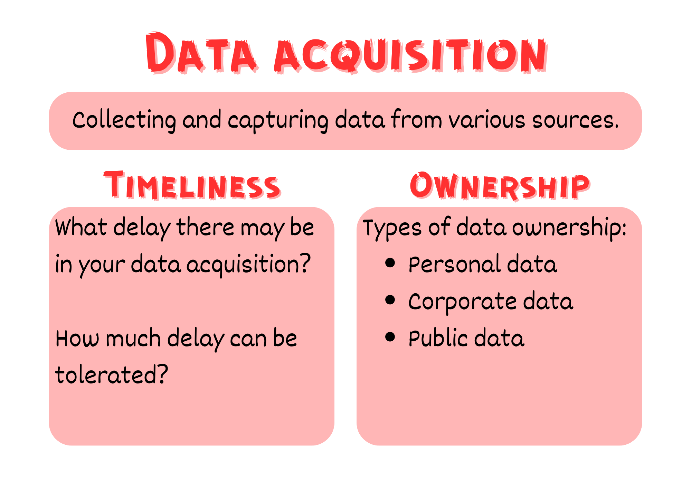
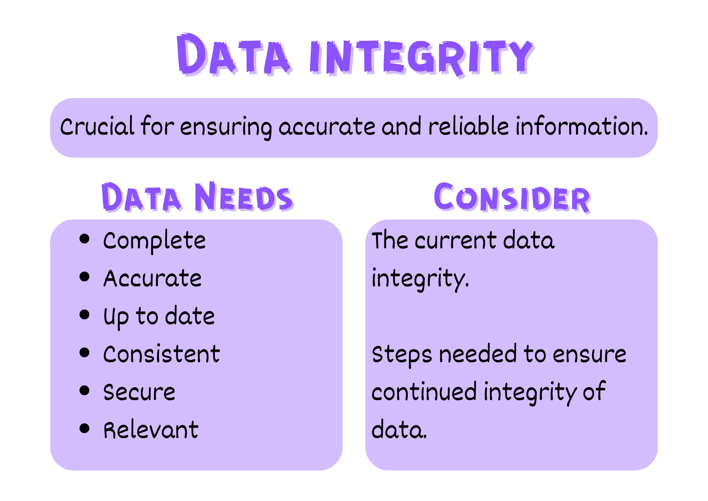
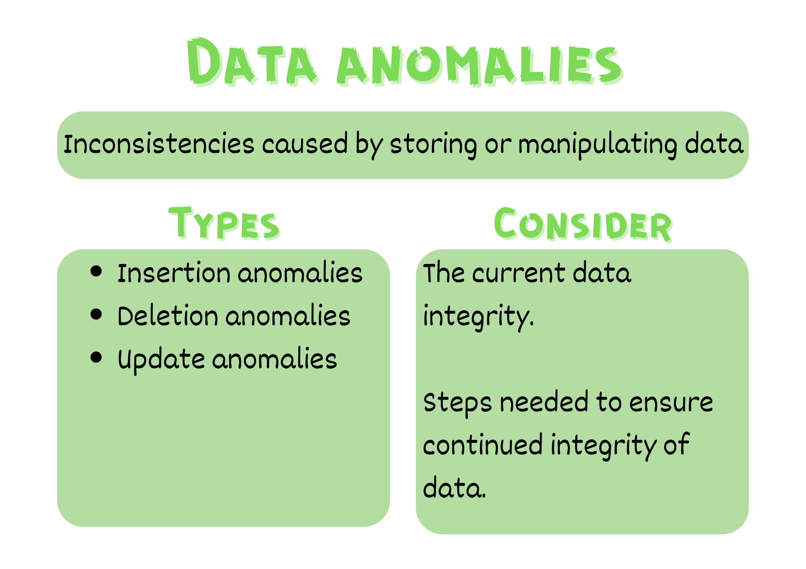
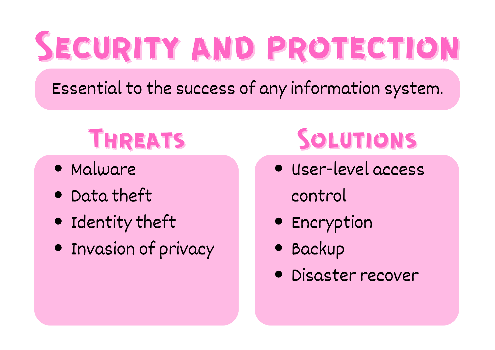

# Data Principles

## Data Management

Delivering a data-driven digital solution requires a detailed understanding of the data involved. Therefore it is vital to consider the data that underpins the application and issues related to managing that data.

These issues fall under four main categories:

- Data acquisition
- Data integrity
- Data anomalies
- Security and protection

### Acquisition

Data acquisition is the process of collecting and capturing data from various sources and converting it into a usable digital format for further analysis and processing. In acquiring the data that will be the foundation of your solution you need to consider both the timeliness of the data acquisition and the ownership of the data.



## Organisation


## Representation


## Integrity



## Anomalies & Redundancy



## Security



```{admonition} Unit 2 subject matter covered:
- Explain the difference between data validation and data verification
- Explain data principles including acquisition
- Explain data principles including organisation, i.e. using appropriate naming conventions, data formats and structures
- Explain data principles including representation
- Explain data principles including integrity
- Explain data principles including anomalies
- Explain data principles including redundancy
- Explain data principles including security
{cite}`queenslandcurriculumassessmentauthority_2017_digital`
```