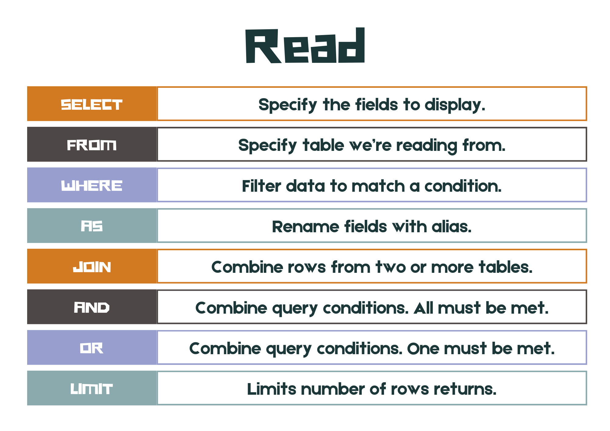
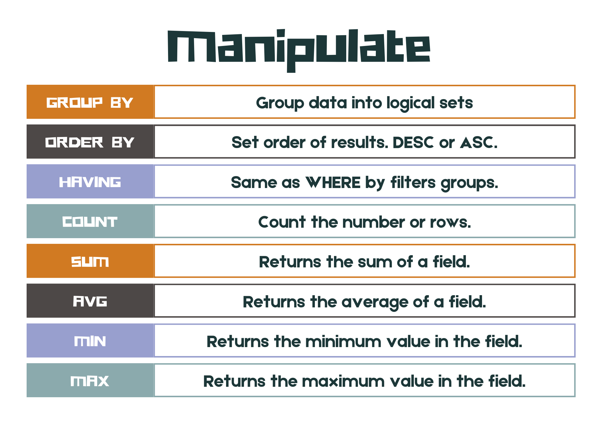
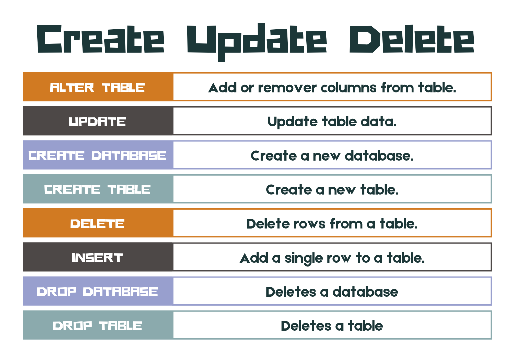

# Managing and Manipulating Data

CRUD








```{admonition} Unit 2 subject matter covered:
- Recognise the elements needed for a data-driven solution, including programming requirements, e.g. SQL and algorithms
- understand SQL syntax and use SQL statements to solve a problem
{cite}`queenslandcurriculumassessmentauthority_2017_digital`
```