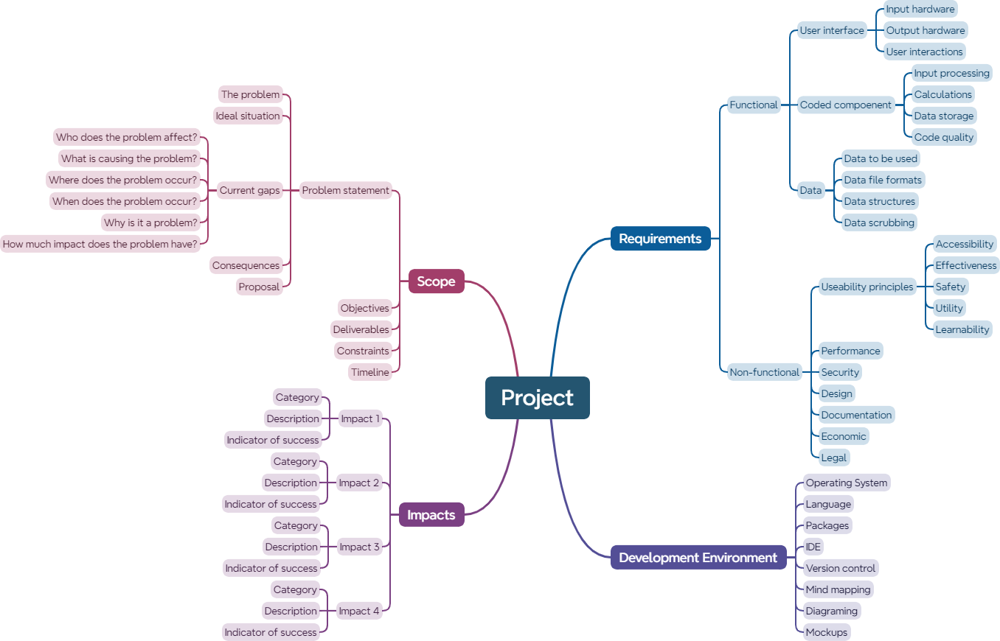

# Mind Map &mdash; Unit 1

## Scope

> Project scope is a way to set boundaries on your project and define exactly what goals, deadlines, and project deliverables you’ll be working towards. By clarifying your project scope, you can ensure you hit your project goals and objectives without delay or overwork {cite}`martins_2022_how`.

The scope of the project provides detail about how the solution will address the problem and what types of things will be produced or delivered. The scope defines the boundaries of the system (or problem) that is being addressed.

The scope includes:

- **Problem Statement:** The problem statement is an overall descriptive statement about what needs to be solved. It includes a justification for the project (explains why is it being undertaken in the first place).
- **Objectives:** These are the overall project goals that will meet the needs of your customers.
- **Deliverables:** The deliverables are the objects are that need to be produced.
- **Constraints and Limitations:** What are the barriers or things that must be adhered to? These are the requirement specifications for the project.
- **Timeline:** How long the project will run for and any specific milestones or checkpoints along the way.

```{admonition} The Developer RPG
:class: attention
In all you projects are role-playing a software developer. When you are thinking about your project, you need to think as a developer, not a student. For example, when describing your project, don't mention submitting your assignment to plagarism checkers, or the submission requirements, as these are features of an assignment. You *should* refer to the delivery date, rather than the due date.
```

### Problem Statement

> A problem statement is a concise and unbiased description of the problem or issues a process improvement project seeks to address. {cite}`indeededitorialteam_2021_what`

Use this step-by-step guide to craft your problem statement:

- **Identify the problem:** Before you write your problem statement, you must first identify the problem.
- **Begin your statement with your ideal situation:** Next, your problem statement should identify the ideal environment if the problem didn't exist.
- **Describe the current gaps:** Concisely identify what the current environment looks like and then focus on the 5Ws and H:
  - **who** does the problem affect?
  - **what** is causing the problem?
  - **where** does the problem occur? Is it location specific?
  - **when** does the problem occurs? **When** did it became a problem? Is it time specific?
  - **why** is it a problem? **Why** must it be resolve?
  - **how** much of an impact does the problem have on individuals or groups?
- **State the consequences of the problem:** Highlight and quantify the consequences of the problem.
- **Propose addressing the problem:** Identify how you will make progress towards reaching the desired goal.

### Objectives

What are the project's overall goals that will meet the needs of your customers. These describe the primary impacts that your solution will have on the users. For example, is your objective to entertain the user, to make them more efficient or to improve their heath?

### Deliverables

What are the objects are that you need to produced? This may be the final product, or it may be a milestone towards this product. 

In Unit 1 you will have two different deliverables:

- **FIA1** &mdash; technical proposal
- **FIA2** &mdash; low-fidelity prototype

### Timeline

How long the project will run for? What are the specific milestones or checkpoints along the way? The criteria sheet will contain explicit checkpoints.

## Impacts

From our **[Digital Solutions Impacts](../2_concepts/3-3_impacts.md)** choose three or four impacts that you think would naturally align with your solution. In your mind map create a node for each impact and then identify the impact’s:

- **Title** &mdash; what will you name this impact (replaces Impact 1, Impact 2 etc.)
- **Category** &mdash; personal, social, economic or environmental
- **Description** &mdash; brief description of your impact
- **Indicator of success** &mdash; describe succinctly how you will know if you will achieve the impact.

## Requirements

The solution requirements specify the capabilities that are critically required for the solution to effectively meet the needs of the users and deliver value.

At this stage of the investigation, it is important to note that we are identifying the requirements that have been asked of us, *we are not identifying everything we want to do*. These requirements might be explicitly listed under a requirements heading, or they may be implied throughout the criteria sheet and stimulus.

Solution requirements can generally be broken down into two different categories: functional requirements and non-functional requirements.

### Functional requirements

These are concerned with what the system needs to do.

These can include:

- **User interface** criteria concerning:
  - User's input hardware (eg. mouse and keyboard)
  - User's output hardware (eg. screen, speakers)
  - User's interaction with the system, including the specific **<a href="https://www.usability.gov/how-to-and-tools/methods/user-interface-elements.html" target="_blank">UI components</a>** that they might use (eg. a date picker)
- **Coded components** provide a list of specific code modules that  need to be developed to:
  - Process input provided by the user
  - Perform calculation on using data to produce results
  - Permanently store data or display stored of calculated data
  - Also address the quality of the code through **[good practice](../2_concepts/2-2_good_practice.md)**:
    - Effective - can solve the identified problem
    - Efficient - uses minimal resources to solve identified problem
    - Maintainable - code that is easy to read and modify
    - Reliable - operate without producing errors or fail at a task
- **Data** criteria concerning:
  - Data to be used (eg. any data that will be supplied or entered)
  - File formats to be used (eg. files saved as .txt files)
  - **[](data_structures)** to be used

### Non-functional requirements

Non-functional requirements specify the manner or the environment in which a solution is intended to operate.

They are concern with such matters as:

- **[Usability principles](../2_concepts/3-1_useability_principles.md):**
  - Accessibility &mdash; the ability to be used by many different people, even people with disabilities.
  - Effectiveness &mdash; the ability of users to use the system to do the work they need to do. Effectiveness includes reliability, which means the solution needs to be constant, dependable, consistent and repeatable.
  - Safety &mdash; the ability for users to make errors and recover from the mistake.
  - Utility &mdash; the ability of the system to provide all the functionality that users need.
  - Learnability &mdash; how easy the system is to learn
- **Performance:** How quickly and efficiently the solution works and how it responds to commands and requests for action
- **Security:** The level of protection the system and its data are expected to have in place
- **Design:** The visual elements expected from the solution
- **Documentation:** The type and extent of written documentation expected or needed (eg. help manuals)
- **Economic:** The financial component of the project. Is there a budget? Can it have a running cost?
- **Legal:** The legal frameworks that the project must work within. The most common are privacy and intellectual property laws.

**Note:** it is possible, depending on the project, that some of the nodes could be empty.

## Development Environment

This talks about the tools (software and hardware) you, as the developer, will use. This node will be completed before you start the generation phase, but most of the tools can be found on the **[Tools Used](../1_introduction/2_tools_used.md)** page.

At this stage, add the tools you think you will use. You can add more later.

## Template

Below is a starting template for your mind maps



```{admonition} Checking the Mind Map for Unit 1
:class: warning
When marking a Mind Map the following questions are asked:

- Have all the nodes been responded to?
- Are all the responses short (less than a sentence)?
```

```{admonition} Unit 1 subject matter covered:
- Understand methods of breaking down problems into parts using computational thinking and thinking tools, e.g. mind maps
- Analyse problems to identify the human need, want or opportunity that requires a new or re-imagined digital solution
- Analyse problems to identify where and how digital technologies are used to solve problems to meet personal, societal and organisational needs
- Analyse a given problem to identify technical issues of the problem that influence the user-interface requirements
- Analyse problems to identify essential elements, components and features of problems in Digital Solutions
- Analyse a given problem to identify missing, required or unnecessary facts or information
- Analyse a given problem to identify constraints and limitations of the environment
- Understand and describe personal, social and economic impacts
- Explore existing user interfaces to identify pitfalls and useful solutions
- Explore existing user interfaces to determine how user characteristics influence the user-interface requirements and user experience for problems and solutions in relation to the useability principles
{cite}`queenslandcurriculumassessmentauthority_2017_digital`
```