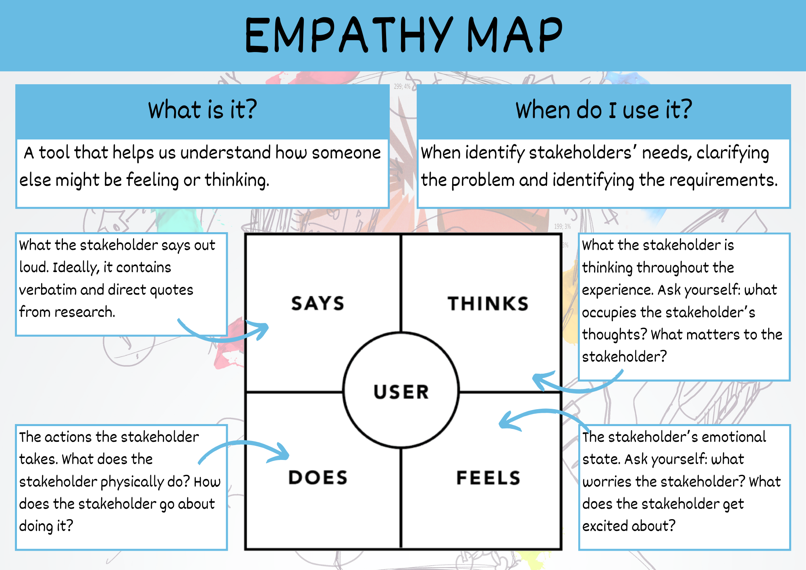
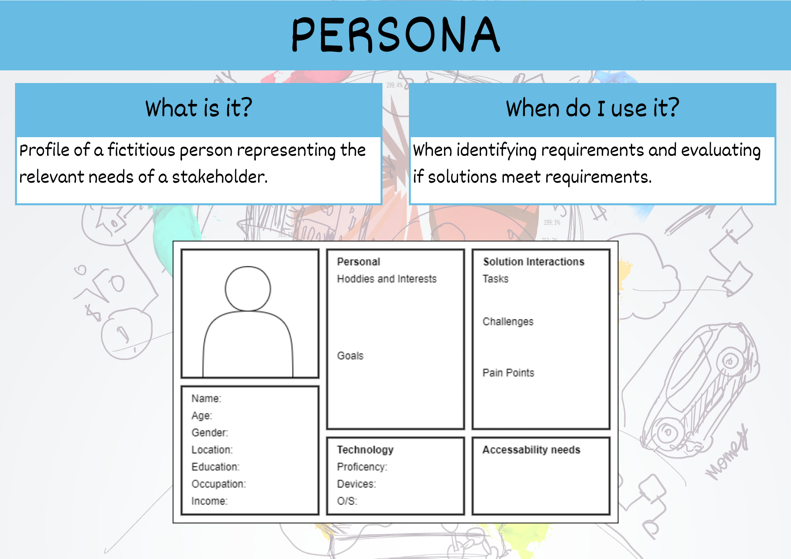

# User Insights &mdash; Unit 1

## Empathy Map



To fill out an empathy map, consider:

- **Says** &mdash; what the user says about the problem in an interview or some other usability study.
- **Thinks** &mdash; what the user is thinking throughout the experience.
  - What occupies the user’s thoughts?
  - What matters to the user?
  - It is possible to have the same content in both Says and Thinks. However, pay special attention to what users think, but may not be willing to vocalize.
- **Does** &mdash; the actions the user takes.
  - What does the user physically do?
  - How does the user go about doing it?
- **Feels** &mdash; the user’s emotional state, often represented as an adjective plus a short sentence for context.
  - What worries the user?
  - What does the user get excited about?
  - How does the user feel about the experience?

Synthesise the user’s needs based on the empathy map. This will help define the design challenge. To synthesise an empathy map, group similar recorded observations together in order to find themes. Then Identify needs directly from the user traits noted.

In doing this be aware that:

- Needs are verbs and frame activities, actions and desires.
- Refrain from using nouns as they will lead to defining solutions, and this is not the aim of the process.

```{admonition} Checking the Empathy Maps for Unit 1
:class: warning
When marking the Empathy Maps the following questions are asked:

- Are all the types of users represented?
- Are there adequate observations in all four quadrants?
```

## Persona



When interviewing personas you need to consider:

- personal life
- technical background
- employment
- professional questions

Personas need to be specific, rather than general, so create a fictitious person.

Components of a persona:

- image (of a real person)
- name
- demographics
  - age
  - gender
  - location
  - education
  - occupation
  - income
- personal
  - hobbies and interests
  - goals (general or specific to the problem)
- technology
  - proficiency (can use fluently)
  - devices
  - o/s
- solutions interactions
  - tasks the user wants to complete with the solution
  - challenges they have in completing tasks
  - pain points &mdash; what makes things difficult
- accessibility needs

```{admonition} Checking the Personas for Unit 1
:class: warning
When marking the Personas the following questions are asked:

- Are all the types of users represented?
- Have the provide proto-personas been used?
- Do the personas cover include people with impairment?
```

```{admonition} Unit 1 subject matter covered:
- Analyse a given problem to identify the user perspective and user-experience requirements
- Recognise and describe the meaning and importance of user experience
- Recognise and describe useability principles including accessibility, effectiveness, safety, utility and learnability
{cite}`qcaa_2017_digital`
```