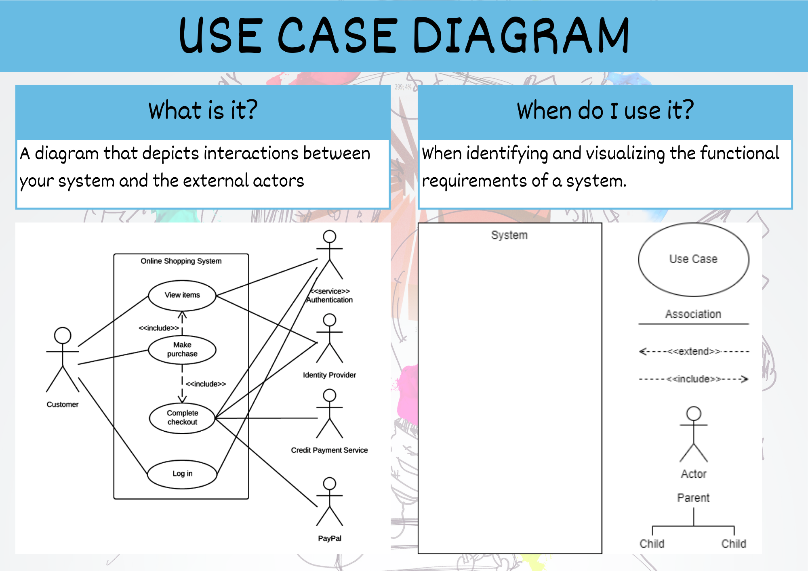

# Use Case Diagram &mdash; Unit 1



## Steps to create a Use Case Diagram

1. What is the system being created?
2. Who are the actors using the system? (People, Organisations, Other systems, External devices)
3. Is each actor a primary actor or a secondary actor?
4. What actions will the primary actors want to do with the system?
5. How will each actor interact with the use cases?
6. Are the any new actions automatically connected to current use cases?
7. Are there any additional, optional actions connected to current use cases?
8. Do any use cases or actors have sub categories?

## Use Case Diagram Symbols


```{admonition} Unit 1 subject matter covered:
- Analyse a given problem to identify the boundary or scope of the problem
- Recognise the elements needed for a data-driven solution, including boundary or scope
```