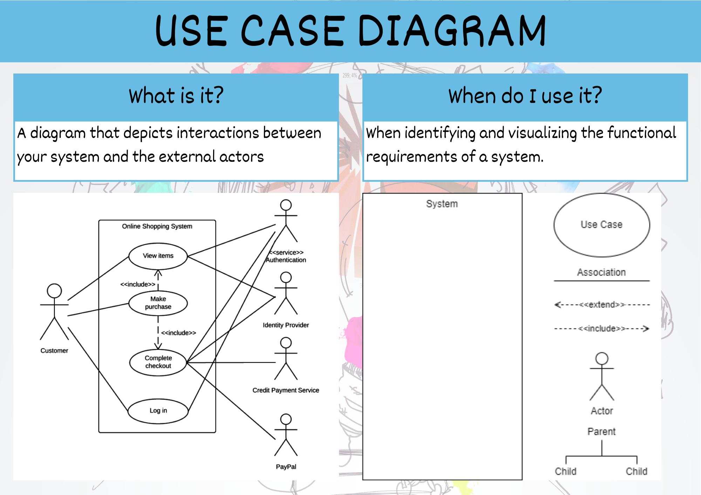

# Use Case Diagram &mdash; Unit 4



## Steps to create a Use Case Diagram

1. What is the system being created?
2. Who are the actors using the system? (People, Organisations, Other systems, External devices)
3. Is each actor a primary actor or a secondary actor?
4. What actions will the primary actors want to do with the system?
5. How will each actor interact with the use cases?
6. Are the any new actions automatically connected to current use cases?
7. Are there any additional, optional actions connected to current use cases?
8. Do any use cases or actors have sub categories?

## Use Case Diagram Symbols


```{admonition} Checking the Use Case Diagram for Unit 4
:class: warning
When marking a Use Case Diagram the following questions are asked:

- Are all the actors outside of the code base?
- Do the primary actors (the ones on the left) initiate the interactions with the system?
- Does the system initiate the interactions with the secondary actors (the ones on the right)?
- Are all the UI interactions represented in the first column of Use Cases?
- Are the connections between the primary actors and the first column of Use Cases all associations (solid lines)?
- Are the conenctions between internal Use Case either extensions or inclusions?
- Do all the extensions have callout detailing what conditions result in it's execution.
- Is the API represented as a secondary actor?
```

```{admonition} Unit 4 subject matter covered:
- Analyse problems and information to determine boundary of scope of given problems
{cite}`qcaa_2017_digital`
```