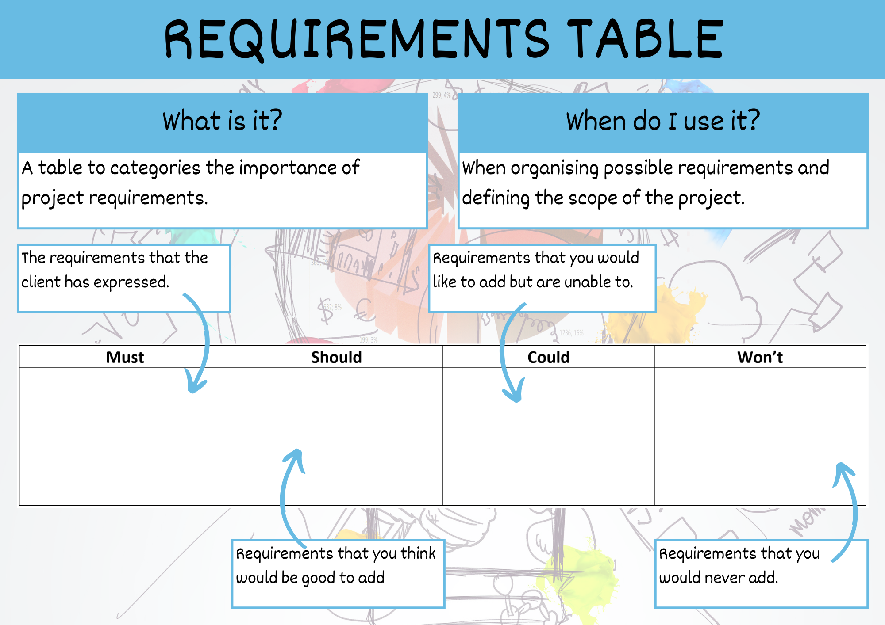
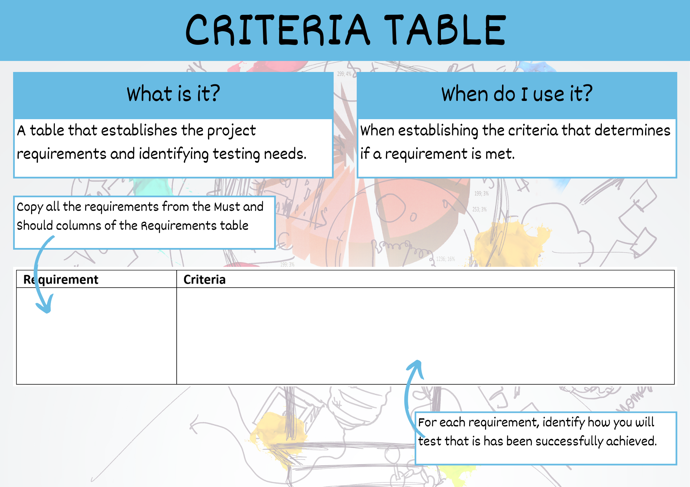

# Success Criteria &mdash; Unit 1

## Requirements Table



Categorise the requirements in your exploration documents (mind map, empathy map, personas, and use case diagram) into on of the four columns:

- **Must** &mdash; all the requirements that are explicitly expressed in the criteria sheet, stimulus material or from client interactions.
- **Should:** &mdash; requirements that you think are important. It might include functional and non-functional requirements not mentioned in the criteria sheet or stimulus (eg. the Usability Principle of Safety).
- **Could:** &mdash; really good ideas that you do not have the time, skills or resources to implement (eg. integrating with social media).
- **Won't** &mdash; ideas that other might like, but you are not interested in (eg. integrating with social media). **Don't simply put the negative of a requirement** (eg. if you have mentioned the Usability Principle of Effectiveness, don't add "Won't crash" to this column).

```{admonition} Checking the Requirements Table for Unit 1
:class: warning
When marking a Requirements Table the following questions are asked:

- Are all the requirements from the criteria sheet (explicit and implicit) included in the Must column?
- Are all the requirements expressed by the stakeholds' communications included in the Must column?
- Are there any requirements in the Must column which have not come from the criteria sheet or stakeholder?
- Does the Should column include requirements that address Useability Principles?
- Are all the requirements in the Should column feasible for the current project?
- Are all the requirements in the Could column not feasible for the current project?
- Are any of the requirements in the Won't column an inverse of another requirements elsewhere in the table?
```

## Criteria Table



You will be using two Criteria Tables:

- Prescribed Criteria
- Self-determined Criteria

Make a criteria table for the prescribed criteria, and copy **all** the requirements from the **Must** column. Make a second table for the self-determined criteria and copy **all** the requirements from the **Should** column.

### Making the criteria

For both the prescribed and self-determined requirements, we now need to work out how to measure if they have been achieved. The measure that we use of each requirement is called the criteria.

Criteria should be expressed in the form of a SMART goal. This means the goals need to be:

- **Specific**
  - State what you will do
  - Use verbs
- **Measurable**
  - Provide a way to evaluate
  - Use specific metrics or targets that can be tested
- **Achievable**
  - Within the scope of the problem
  - Is it realistically possible to accomplish or attain
- **Relevant**
  - Makes sense within the project
  - Provides benefit to the user in some way or improves the project or user experience
- **Time bound**
  - State when you will show evidence that this is achieved
  - Be specific on dates, times, phase of the Digital Solutions development phases

These goals can be expanded or modified during the project life-cycle if required.

```{admonition} Checking Criteria Tables for Unit 1
:class: warning
When marking a Criteria Tables the following questions are asked:

- Are all the requirements from the Must column, included in the Prescribed Criteria Table?
- Are all the requirements from the Should column, included in the Self-determined Criteria Table?
- Are all the criteria in the SMART format?
```

```{admonition} Unit 1 subject matter covered:
- Analyse a given problem to identify the requirements of the solution
- Analyse a given problem to identify prescribed and self-determined criteria to evaluate the personal, social and economic impacts of the solution
{cite}`queenslandcurriculumassessmentauthority_2017_digital`
```
