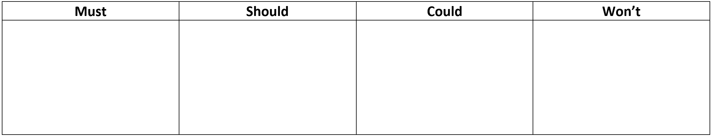

# Success Criteria

You have now fully explored the problem and identified all the requirements. The next step is to prioritise the requirements and established the method you will use to determine if they have been achieved.

## Requirements Table

The requirements table is used to prioritise the identified requirements. Categorise the requirements in your exploration documents (mind map, empathy map, personas, and use case diagram) into on of the four columns:

- **Must** &mdash; all the requirements that are explicitly expressed in the criteria sheet, stimulus material or from client interactions.
- **Should:** &mdash; requirements that you think are important. It might include functional and non-functional requirements not mentioned in the criteria sheet or stimulus (eg. the Usability Principle of Safety).
- **Could:** &mdash; really good ideas that you do not have the time, skills or resources to implement (eg. integrating with social media).
- **Won't** &mdash; ideas that other might like, but you are not interested in (eg. integrating with social media). **Don't simply put the negative of a requirement** (eg. if you have mentioned the Usability Principle of Effectiveness, don't add "Won't crash" to this column).

## Criteria Table

Criteria are the characteristics by which a project is evaluated or judged. They should be written in a way that states what actions will be taken to check that the requirement is met. For example, for a requirement of having accessible on-screen text, the criteria would be &mdash; passes AAA text contrast test. In Digital Solutions, there are two types of criteria, prescribed and self-determined.

### Prescribed Criteria

Prescribed criteria are those criteria that are provided or placed on a project by the client. In an educational context like Digital Solutions, these can also be provided by the teacher or detailed in an assignment.

In our workflow, we have already identified our prescribed requirements in the **Must** column of the Requirements table. Create a Prescribed-criteria table (see below) and transfer **all** the requirements from the Must column into the Requirements column.

### Self Determined Criteria

Self-determined criteria are any criteria that, rather than being prescribed, have been identified throughout the Explore phase.

In our workflow, we have also identified our self-determined requirements. They are in the **Should** column of the Requirements table. Create a Self-determined criteria table and transfer **all** the requirements from the Should column into the Requirements column.

