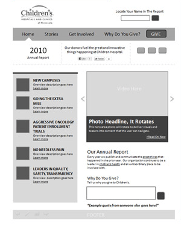
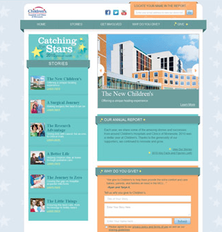

# UI Design &mdash; Unit 1

There are many different ways to symbolise a UI. In our course, you will only need to use mock-ups, but it is useful to know and understand what the other methods are used for.

## Sketching

User Interface sketching refers to sketching out the basics of a user interface, most often using pen and paper. It occurs before getting into wireframing, prototyping and coding. Sketches are quick and dirty. Don't worry about the specifics of design or functionality in a UI sketch. A UI sketch should simply serve to help you eliminate bad ideas and brainstorm good ideas about how to bring your proposed product to the screen. The sketch should help you translate idea to interface in the minimum possible time. At the end of the UI sketching process you should know that you've figured out the absolute best way to bring your product to the screen.


## Wireframe

A wireframe gives you a rough idea of the input, how it is processed, how the screens will be presented, how the elements will look etc. A wireframe tells you what happens when an action is taken using the app. If there is content on the screen, wireframe gives you an idea of how that data or element will be presented in the app. The goal of a wireframe is to quickly and easily communicate:

- The contents of the page
- The page structure and layout
- The app's functions

In other words, a wireframe describes the basic structure, functions, and content of the page.



## Mock-up

The wireframe shows the basic structure with the contents of the app and the functions, whereas a mockup adds design, colour, style, and typography to it. A mockup shows a realistic picture of how things will shape up in the end. The visual representation of the mockup will show what all will be covered in the final picture.

We will be using two different tools for creating Mockups:

- **FIA1:** Adobe XD
- **FIA2:** QT Designer



## Prototype

A prototype is a final visual image of the app. The prototype acts just like the app to some extent. The code used for development is not used for creating a prototype, but it can still have clickable buttons and other components of a real app and may demonstrate some of the functionality.

## Application interface flowchart

An application interface flowchart connects the screens of an application together to indicate the flow from one screen to another as a result of user interactions. Interactions are sometime written on the flowlines.


## Annotating

Annotating the UI is an import way to show how you have incorporated the Useability Principles into your UI design.

Each annotations should have the following features:

- A description of how you have incorporated a Useability Principle.
- An arrow pointing to an example of this on the UI.
- Each annotation should only deal with one principle and one example.
- The Useability Principle should be in bold.

Below is an example of an annotated mockup.


```{admonition} Unit 1 subject matter covered:
- Symbolise ideas for a user interface using sketches, diagrams, schematic diagrams or mock-ups
- Recognise and describe useability principles including accessibility, effectiveness, safety, utility and learnability
{cite}`queenslandcurriculumassessmentauthority_2017_digital`
```