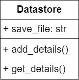
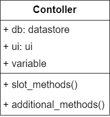

# Class Diagram &mdash; Unit 1

For unit 1 your programs will, most-likely consist of the three MVC classes (UI, Controller and Datastore). There will be very little need to move beyond these.

## UI Class

You will generate the UI Class from your QT Designer file. Therefore, there is no reason for you to plan the class using a class diagram.

## Datastore Class

Using **[MVC Architecture](mvc)**, the datastore (model) class is responsible for storage and retrieval of information. For unit 1, this mean saving and reading from files on the hard drive.

A template for the class diagram would look like this:



The datastore class diagram will need:

- an attribute that stores the save file name. There will need to be an attribute for each save file.
- add methods for each type of save to the hard drive
- get methods for each type of retrieval from the hard drive

```{admonition} Naming Methods
:class: tip
It is value to establish a consistent style for your method names. This enhances maintainability through the improving the readablity of your code, as-well-as reducing errors but developing a habit.

For example, in the datastore:

- using the prefix of `add` for all methods that write data to the hard drive
- using the prefix of `get` for all methods that retreieve data from the hard drive
- using the prefix of `update` for all methods that change the data on the hard drive
```

## Controller Class

The **[MVC Architecture](mvc)** requires that all the program logic resided in the Control Class. It response to interactions from the ui class (signals). It collects data from the ui class and retrieves stored data from the datastore class. It processes this data, and then sends data to the ui class to be displayed or data to the datastore class to save.

This will be the most complicated class in your program, and a template would look like this:



The controller class diagram will need:

- an attribute for the datastore object
- an attribute for the ui object
- attributes for any other variables that are needed for the program logic
- a slot method to handle each signal from the UI
- additional methods for programming logic
