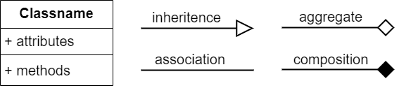
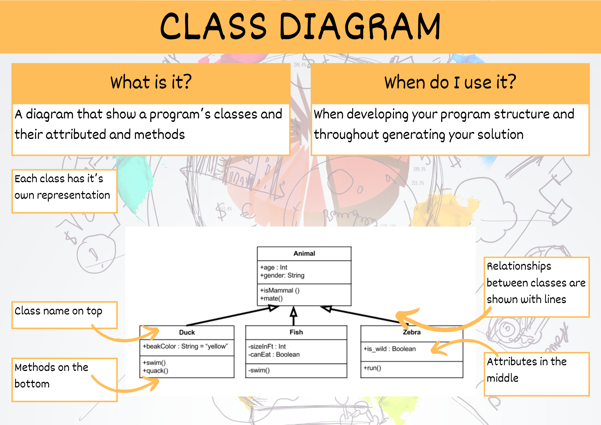

# Class Diagram

> Class diagrams clearly map out the structure of a particular system by modelling its classes, attributes, operations, and relationships between objects {cite}`lucidchart_2017_uml`.

Class diagrams are particularly useful when using Object Orientated Programming.

The standard class diagram is composed of three sections:

- **Upper section:** Contains the name of the class. This section is always required.
- **Middle section:** Contains the attributes of the class. Use this section to describe the qualities of the class.
- **Bottom section:** Includes class operations (methods). Displayed in list format, each operation takes up its own line.

<iframe width="560" height="315" src="https://www.youtube.com/embed/UI6lqHOVHic" title="YouTube video player" frameborder="0" allow="accelerometer; autoplay; clipboard-write; encrypted-media; gyroscope; picture-in-picture" allowfullscreen></iframe>

{cite}`lucidchart_2019_uml`

## Class Diagram Symbols



```{admonition} Checking the Class Diagram
:class: warning
When marking a Class Diagram the following questions are asked:

- Are all the code's classes represented?
- Does the diagram's attributes match the variables in the class' `__init__` method?
- Does the diagram's methods match the class' methods?
```

## Summary



```{admonition} Unit 1 subject matter covered:
- Symbolise algorithms and interrelationships with sketches and diagrams
{cite}`qcaa_2017_digital`
```

```{admonition} Unit 2 subject matter covered:
- Symbolise well-ordered and unambiguous algorithms using pseudocode for procedural code that processes data for insertion into a database or manipulates or displays retrieved data
- Symbolise well-ordered and unambiguous algorithms using pseudocode for user interaction, data validation and data presentation
{cite}`qcaa_2017_digital`
```

```{admonition} Unit 3 subject matter covered:
- Generate a conceptual model of a possible solution by applying systems thinking that identifies system boundaries, properties, inputs and outputs, user interface, system controls
- Recognise and describe program components such as objects, event handlers and multimedia assets
{cite}`qcaa_2017_digital`
```

```{admonition} Unit 4 subject matter covered:
- Symbolise and explain how application sub-systems, e.g. front end, back end, work together to constitute a solution
{cite}`qcaa_2017_digital`
```