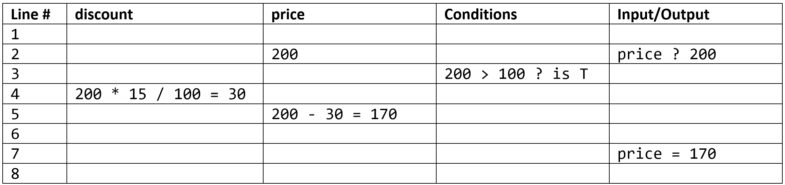

# Desk Check

Desk checking is a manual (non computerised) technique for checking the logic of an algorithm. The person performing the desk check effectively acts as the computer, using pen and paper to record results. The desk checker carefully follows the algorithm being careful to rigidly adhere to the logic specified. The desk check can expose problems with the algorithm.

Desk checks are useful to check an algorithm (before coding) thereby confirming that the algorithm works as expected and reduces the likelihood of creating programs with logic errors. Another benefit of a desk check is that it confirms to the programmer/designer that the algorithm performs as intended.

```{admonition} Types of programming errors
:class: tip
There are three categories of computer errors: 

- **Syntax errors**:
    - occur due to violations of language grammar rules, eg. failing to put quotes around a string.
    - typically identified and corrected using development environment feedback
- **Runtime errors**
    - arise during program execution due to unexpected conditions, eg. the user entering a string instead of a integer.
    - require condition checks and error handling mechanisms for resolution
- **Logic errors**: 
    - result in incorrect outcomes due to flaws in the program's design or logic, eg. a condition using `>` instrad of `<`.
    - requires thorough testing and debugging to understand and correct the program's behaviour.
```

A desk check is normally done as a table with columns for:

- Pseudo code line number - Pseudo code doesn't normally have lines numbers, but these are necessary in a desk check to specify the line(s) being executed
- One column per variable used.
  - The columns should be in alphabetical order on variable name with the variable name at the top of the column.
  - As the algorithm is executed, the new values of the variables are put in the appropriate column.
  - Show working for calculations.
  - If variable names consist of a number of words it is permissible to put a space between each word in the name so that the name fits better in the column by wrapping to the next line. e.g. the variable column heading discount Price could be used rather than the actual variable name discountPrice.
- condition column.
  - The result of the condition will be true (T) or false (F).
  - As the algorithm is executed, conditions are evaluated and the details are recorded in the column.
  - Show working when evaluating the conditions.
  - This is used whenever a condition is evaluated - IF WHILE or FOR statements all have explicit or implicit conditions.
- Input/Output
  - used to show what is input by the user and displayed by the program.
  - Show inputs with: the variable name, a "?" and the value input e.g. price ? 200.
  - Show outputs with the variable name, an =, and the value displayed (or just the value displayed) e.g. discountPrice= 180 .

## Branching Example

Consider the following pseudocode:

``` pseudocode
1 BEGIN calcPrice()
2    INPUT price
3    IF price > 100 THEN
4        discount = price * 15 / 100
5        price = price - discount
6    ENDIF
7    DISPLAY price
8 END
```

Since it has branching logic, you will need to run a test for each of the branches (in this case two).

Inputs: price = \$200  
Correct results: price = \$170


Inputs: price = \$50  
Correct results: price = \$50.


## Iteration Example

Consider the following pseudocode:

``` pseudocode
1 BEGIN calcSquares()
2    DISPLAY "X", "X Squared"
3    FOR x = 1 TO 3
4        xSquared = x * x
5        DISPLAY x, xSquared
6    NEXT x
7    ENDFOR
8    DISPLAY "-----------"
9 END
```


```{admonition} Unit 1 subject matter covered:
- Evaluate and make recommendations about algorithmic steps using debugging processes, e.g. desk checks
{cite}`qcaa_2017_digital`
```

```{admonition} Unit 2 subject matter covered:
- Test the SQL, algorithm and procedural code components of the prototype digital solution for reliability, maintainability and efficiency
{cite}`qcaa_2017_digital`
```

```{admonition} Unit 3 subject matter covered:

{cite}`qcaa_2017_digital`
```

```{admonition} Unit 4 subject matter covered:
- Evaluate by desk checking algorithms to predict the output for a given input, identify errors and validate algorithms
{cite}`qcaa_2017_digital`
```