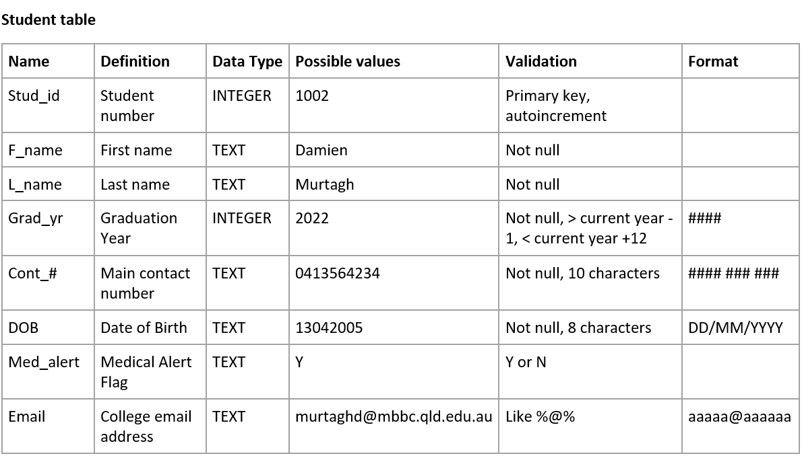
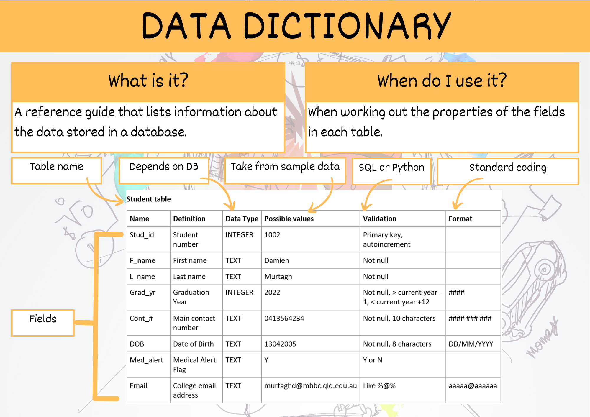

# Data Dictionary

A data dictionary is a reference guide that lists information about the data in a database or system, such as its name, type, and rules for use. It helps ensure accurate and consistent use of the data.

The following video explains data dictionaries

<iframe width="560" height="315" src="https://www.youtube-nocookie.com/embed/aOVN0v-HWcQ" title="YouTube video player" frameborder="0" allow="accelerometer; autoplay; clipboard-write; encrypted-media; gyroscope; picture-in-picture; web-share" allowfullscreen></iframe>

Your data dictionaries should include the following details:

- **Name of Field:** make sure you follow you naming conventions
- **Definition of the Field:** these details should naturally flow from the ERD
- **Data type:** in SQLite we have Text, Integer, Real, and Blob
- **Possible values:** taken from sample data
- **Validation rules:** ensures only correct values can be entered
  - SQLite has built in <a href="https://www.tutorialspoint.com/sqlite/sqlite_constraints.htm" target="_blank">validation rules</a>: 
    - NOT NULL - Ensures that a column cannot have NULL value
    - DEFAULT Constraint − Provides a default value for a column when none is specified
    - UNIQUE Constraint − Ensures that all values in a column are different
    - PRIMARY KEY Constraint − Uniquely identifies each row/record in a database table
    - CHECK Constraint − Ensures that all values in a column satisfies certain conditions.
  - Data can also be validated in Python before Inserting it into the database.
- **Formatting:** data can either be stored formatted or can be formatted once retrieved.

Below is an example of a data dictionary. Note that you should create a data dictionary for each table is your database.

## Summary

