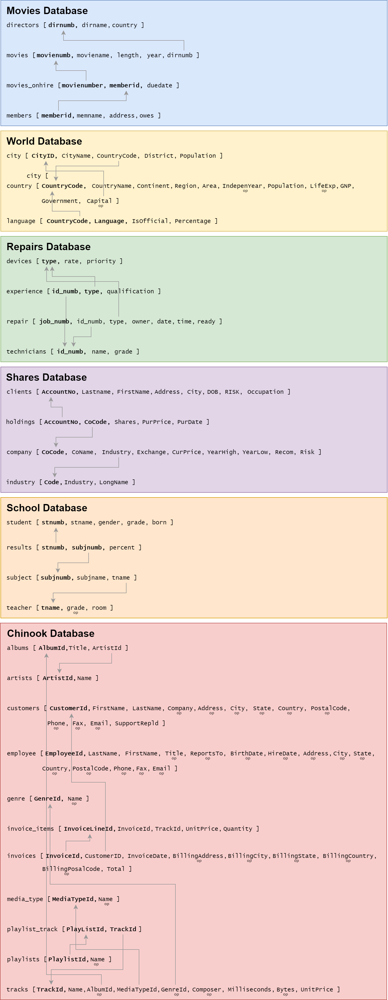

# Coding &mdash; Unit 2

## SQL

SQL (Structured Query Language) is a standard programming language specifically designed for managing and manipulating relational databases. It allows users to create, read, update, and delete data within a database, as well as to define and manage database structures. SQL is used to perform tasks such as querying data to retrieve specific information, inserting new data records, updating existing data, and deleting unwanted data. Additionally, SQL enables the creation of database schemas, the definition of relationships between different data tables, and the implementation of security measures to control access to the data. Its powerful and versatile nature makes SQL an essential tool for database management and analysis.

According to Stack Overflow's 2023 Developer Survey {cite}`stackoverflow_2023_stack`, SQL-based databases dominate the database management system (DBMS) market. It is estimated that approximately 90% or more of databases use SQL.

### Database Resources

For the following SQL section we will be using the following databases:

- [Chinook database](./assets/chinook.db)
- [Movies database](./assets/moives.db)
- [Repairs database](./assets/repairs.db)
- [School database](./assets/school.db)
- [Shares database](./assets/shares.db)
- [World database](./assets/world.db)

Below is the Relational Schemas for these databases



[Exercise solutions](../8_solutions/1_sql_exercises.md) can be found in the solutions section.

### SELECT Statement

The SQL `SELECT` statement is used to retrieve specific data from tables within a relational database. The data is return in the form of a table.

#### SELECT Tutorials

Complete:

- [W3schools Tutorial](https://www.w3schools.com/sql/sql_select.asp) on the `SELECT` statement
- [W3schools Tutorial](https://www.w3schools.com/sql/sql_distinct.asp) on the `SELECT DISTINCT` statement

#### SELECT Exercises

Using the **Movies** database:

- Display the name of all the directors
- Display the name of all the members
- Display the details in the movie table
- Display all the years of release with no duplications
- Display the number of all movies on hire and when they are due back

### WHERE clause

The SQL `WHERE` clause is used to filter records in a database query to include only those that meet specified conditions.

#### WHERE Tutorials

Complete

- [W3schools Tutorial](https://www.w3schools.com/sql/sql_where.asp) on the `WHERE` clause
- [W3schools Tutorial](https://www.w3schools.com/sql/sql_and_or.asp) on the `AND`, `OR` and `NOT` operators
- [W3schools Tutorial](https://www.w3schools.com/sql/sql_like.asp) on the `LIKE` operator
- [W3schools Tutorial](https://www.w3schools.com/sql/sql_null_values.asp) on `NULL` values

#### WHERE Exercises

Using the Movies database

- Display the name of all the US directors
- Display the name of the all non-US directors
- Display the name of all the members who owe money
- Display all the movies that have 'the' in their title
- Display all the movies that start with Z

Using the Repairs database

- List the owners whose repair is ready to collect
- List the owners whose iMac is still being repaired

Using the World database

- Which countries have not achieved independence but still have a capital
- Which countries are missing information?
- List countries that are either constitutional monarchies or republics

### Filters and Aggregators

SQL filter clauses are used to restrict the number of rows returned by a query based on specified conditions, enabling more precise data retrieval and manipulation. While SQL aggregators are functions used to perform calculations on multiple rows of a table's column and return a single value. 

#### Filters and Aggregators Tutorials

Complete:

- [W3schools Tutorial](https://www.w3schools.com/sql/sql_top.asp) on the `TOP` and `LIMIT` clauses
- [W3schools Tutorial](https://www.w3schools.com/sql/sql_min_max.asp) on the `MIN()` and `MAX()` functions
- [W3schools Tutorial](https://www.w3schools.com/sql/sql_count_avg_sum.asp) on the `COUNT()`, `AVG()` and `SUM()` Functions

#### Filters and Aggregators exercises

Using the Movies database

- How many directors are there from Australia?
- How many directors have the name John?
- What is the longest movie?
- If I was to watch all the movies, back-to-back, how many minutes will I need (no pausing for toilet stops)

Using the Repairs database

- What is the average repair rate?
- How many repairs are waiting to be picked up?

Using the Shares database

- How many companies are there in the high risk category?
- Which company has the biggest difference between their highest and lowest price?
- What is the cheapest, medium or low risk share on the New York Stock Exchange?
- List all shares that are currently within 10% of their highest price?

### ORDER BY

The SQL `ORDER BY` keyword is used to sort the result set of a query by one or more columns, either in ascending (ASC) or descending (DESC) order.

#### ORDER BY Tutorials

Complete:

- [W3schools Tutorial](https://www.w3schools.com/sql/sql_orderby.asp) on the `ORDER BY` Keyword

#### ORDER BY Exercises

Using the Movies database

- List all the movies names in alphabetical order
- What is the 5 oldest movie in stock?
- Display the movies in chronological order, and then alphabetical order within each year.

Using the School Database

- List the name of the grade 6 students in alphabetical order
- What is the top three results in percentage
- List all the boys' birthdays in order, then all the girls' birthdays in order, with their names

### GROUP BY and HAVING

The SQL `GROUP BY` statement is used to group rows that have the same values in specified columns into summary rows, often in conjunction with aggregate functions to perform calculations on each group. While the SQL HAVING statement is used to filter groups of rows created by the `GROUP BY` clause based on specified conditions, typically involving aggregate functions.

#### GROUP BY and HAVING Tutorials

Complete:

- [W3schools Tutorial](https://www.w3schools.com/sql/sql_groupby.asp) on the `GROUP BY` Statement
- [W3schools Tutorial](https://www.w3schools.com/sql/sql_having.asp) on the `HAVING` Clause

#### GROUP BY and HAVING Exercises

Using the Movies database

- How many directors are there from each country?
- How many movies does each member number have on hire?
- How many movies are stocked from each year?

Using the School database

- What is the average result for each subject(code)?
- How many boys and girls in each grade?

Using the Shares database

- How many companies are there in each risk category?
- What is the cheapest, medium risk and cheapest low risk share on the New York Stock Exchange?

Using the Chinook database

- How many customers are there from each country?
- How many customers in each city?
- How much were the sales for each country?

### Subqueries

SQL sub-queries are queries embedded within another SQL query to provide results that are used by the outer query, enabling more complex and flexible data retrieval and manipulation​. Subqueries are possible since every query returns a table. Effectively, you run one query which returns a table, then you run another query on the data in the returned table.

#### Subqueries Tutorials

Complete:

- [W3schools Tutorial](https://www.w3schools.com/sql/sql_in.asp) on the `IN` Operator

#### Subqueries Exercises

Using the Schools database

- What are the percentage results for students in grade 7
- What subject is taught by the teacher in room A2?
- In which subjects did students score over 90%?
- List the names of the students in grades 4 or 5 who scored over 50% for language.
- List the names of students who do science.

Repairs database

- Who owns devices being repaired by Ted Carrol?
- What are the names of the technicians who are still not expert (N) at repairing Macs?
- What rate will Byrne be charged for repairs?
- List the owners whose devices have a high (H) priority for repair.
- What level of qualification has the technician who is doing James' repair job?

### JOIN

SQL join clauses are used to combine rows from two or more tables based on a related column between them, enabling the retrieval of data that spans multiple tables.

#### JOIN Tutorials

Complete

- [W3schools Tutorial](https://www.w3schools.com/sql/sql_join.asp) on Joins
- [W3schools Tutorial](https://www.w3schools.com/sql/sql_join_inner.asp) on the `INNER JOIN` Keyword

#### JOIN Exercises

Using the Schools database

- What is the average percentage of the students for each teacher
- List all the students taught by Mr Simms

Using the Chinook database

- List all albums, including artist name
- List the name of all the tacks in the metal genre
- List all the details of all Def Leppard tracks.

### Record Management

SQL record management keywords, such as `INSERT`, `UPDATE`, and `DELETE`, are used to add new records, modify existing records, remove records in a database table respectively.

#### Record Management Tutorials

Complete:

- [W3schools Tutorial](https://www.w3schools.com/sql/sql_insert.asp) on the `INSERT INTO` Statement
- [W3schools Tutorial](https://www.w3schools.com/sql/sql_update.asp) on the `UPDATE` Statement
- [W3schools Tutorial](https://www.w3schools.com/sql/sql_delete.asp) on the `DELETE` Statement

#### Record Management Exercises

Using the Movies database

- Add a new director record for Australian director Rachael Perkins
- Add a new member record. Name: Melissa Small, Address: 38 Loggers Ln
- Add movies on hire for Aliens being hired to Reis,E return date is in two weeks.
- Update Fitzgerald,F's address to 13 Elms St
- Lennon,S has paid her fees, adjust the database appropriately
- The store is doing a cull and getting rid of all movies before 1970, adjust the database appropriately.

## Python and SQLite

To work with SQLite in Python, we use the SQLite3 library.

### Setup

SQLite3 is part of the standard library, so we don't need to pip install it, just import it.

So you start a your file with:

``` python
import sqlite3
```

The next step is to connect to the SQLite database your program will use. This is similar concept to opening Word document. If you are going to work on a Word document, first you need to open it.

In this example, we will be connecting to the **chinook.db** database

``` python
connection = sqlite3.connect("chinook.db")
```

The connection is what we use to access the database.

Next we need to create a cursor. A cursor is the 'tool' that we use to edit the data in the database. Again, with our Word analogy, the cursor is where you are editing the text.

``` python
cursor = connection.cursor()
```

So that is two different ways to interact with the database, but they have different purposes:

- **connection** &rarr; works with the database file
- **cursor** &rarr; works with the data in the database

### Queries

To run SQL queries you need to use the `cursor.execute()` method.

Note that the `cursor.execute()` method accepts two arguments:

- **SQL command** &rarr; a string that contains the SQL command. It is important to note that all values in the SQL query are parameterised. This means than rather than hard coding user values into the query, they are included in a collection (either a tuple or dictionary), which is also passed to the method. A placeholder indicates where the values should be inserted.
- **Values collection** &rarr; this contains the values to be added to the query.

```{admonition} Why use parameterised queries
:class: tip
We use parameterised queries for the following reasons:

- **Security:** Prevents SQL injection by separating SQL code from data.
- **Efficiency:** Helps in query optimization and reuse.
- **Simplicity:** Makes code easier to read and maintain.
```

``` python
cursor.execute(
    """
    SELECT customers.FirstName ||" "|| customers.LastName
    FROM customers
    WHERE Country = :country 
    """,
    {
        "country":"USA"
    }
)
```

In the example above we have used the named placeholders example.

- In the SQL query the `:country` is the placeholder.
- Python will look for **country** in the dictionary from the second argument, and then insert the value "USA" in its place.

Once the query has been executed, you need to retrieve the results.

There are three commands to do this:

- **`cursor.fetchone()`** &rarr; retrieves the next row of a query result set, returning a single row as a tuple, or `None` when no more data is available.
- **`cursor.fetchall()`** &rarr; retrieves all remaining rows of a query result set as a list of tuples. If no more data is available, it returns an empty list `[]`.
- **`fetchmany(size)`** &rarr; retrieves the next set of rows from a query result set, returning a list of tuples with at most `size` rows. If fewer rows are available than requested, it returns only the available rows. If no more data is available, it returns an empty list `[]`.

In our example we will retrieve all rows.

``` python
results = cursor.fetchall()
```

Because `fetchall()` returns a list of tuples, we need to iterate through that list to see each row. It would be the same for `fetchmany(size)`.

``` python
for result in results:
    print(result[0])
```

## Converting datastore to a database

One of the advantages of using MVC Architecture is ease of refactoring. You can change any of the three modules, as long as calling the methods that interconnect the modules remain the same. For example, if you want to change the datastore module so it uses a database, you can change that one module and leave the main and UI module alone.

The videos below build on our **[hangman game from Unit 1](2-1_coding_unit_1.md)** by changing the datastore to an SQLite database. The use of a database allows for other features like recording results and having multiple user, so the other two modules are adjusted to include these features. These video also provide an example of a **<a href="https://youtu.be/Vq1laKeSk9M?si=Jj15sQKSG8DpizUp" target="_blank">stacked widget</a>**.

**[Repository for the tutorial resources](https://github.com/DamoM73/gui_hangman_with_sql_starter)**

<iframe width="560" height="315" src="https://www.youtube-nocookie.com/embed/videoseries?si=z4FVl8anWQUm8UJH&amp;list=PLXCOpHy94WuY2zt6lfl3sJmikB3Jj57r-" title="YouTube video player" frameborder="0" allow="accelerometer; autoplay; clipboard-write; encrypted-media; gyroscope; picture-in-picture; web-share" referrerpolicy="strict-origin-when-cross-origin" allowfullscreen></iframe>