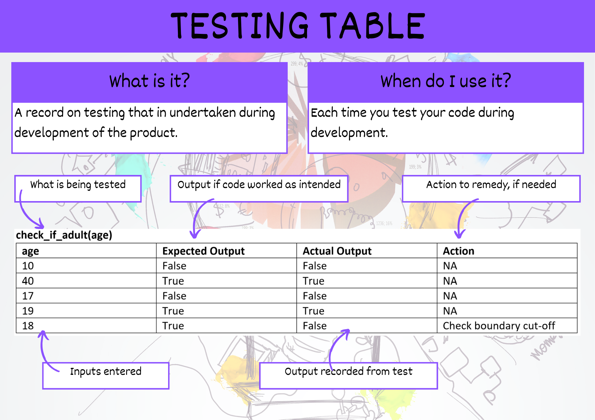

# Testing Table

You will need to test the code that you have generated to ensure the reliability of your code.

During the generate phase your will need to undertake both:

- Unit testing
- Integrated testing

The results of these tests should be recorded in two tables

## Unit testing

Unit testing is a method where individual parts of a program, called units, are tested to ensure they work correctly. 

Imagine a program as a complex machine made of smaller parts, like gears. Each gear needs to work perfectly for the whole machine to function. In unit testing, developers write tests for these 'gears'—which could be functions or methods—to check if they perform as expected when given certain inputs. 

If a test fails, it means there's a problem with that part of the code, and it needs fixing before it can be used with other parts of the program. If unit passes all the tests, then the programmer can be confident that any future errors are not caused by this unit.

This approach helps catch errors early and simplifies debugging, making the development process more efficient and the final program more reliable.

Unit Testing table


## Integrated testing

Integration testing is a phase in software testing where individual pieces of an application, often called units or modules, are combined and tested together as a group. The main goal of this testing is to check if these different parts work well together. For example, in a social media app, integration testing might involve checking if the part that handles user logins correctly interacts with the part that shows friends' posts. 

Integration testing allows testers to find and fix problems where the different parts of the software fail to properly communicate or work together.

Integrated Testing table  


## Summary



```{admonition} Unit 1 subject matter covered:
- Test inputs, outputs and processes
- Evaluate and make recommendations about algorithmic steps using debugging processes, e.g. desk checks
{cite}`queenslandcurriculumassessmentauthority_2017_digital`
```

```{admonition} Unit 2 subject matter covered:
- Test the SQL, algorithm and procedural code components of the prototype digital solution for reliability, maintainability and efficiency
{cite}`queenslandcurriculumassessmentauthority_2017_digital`
```

```{admonition} Unit 3 subject matter covered:
- Evaluate by testing program modules for reliability, maintainability and efficiency using computational thinking processes such as debugging to refine a prototype digital solution
{cite}`queenslandcurriculumassessmentauthority_2017_digital`
```

```{admonition} Unit 4 subject matter covered:
- Evaluate solutions by testing to refine their accuracy, reliability, maintainability, efficiency, effectiveness and useability
{cite}`queenslandcurriculumassessmentauthority_2017_digital`
```
