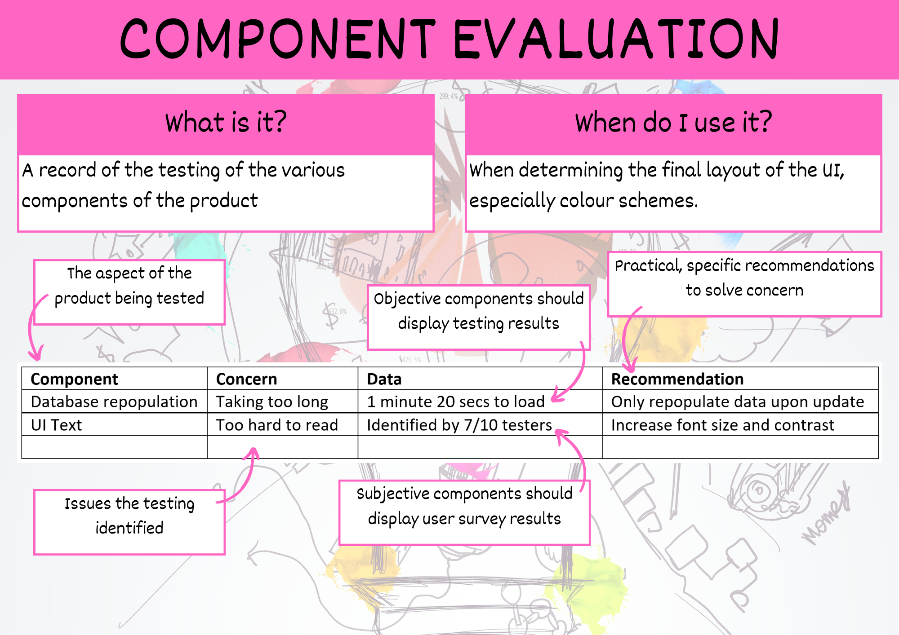

# Component Evaluation

The evaluation of components is achieved through completing **[unit tests](../5_generate/3_testing_table.md)** and occurs throughout the Generation phase, up to and including the end.

Every time you make a change to your solution in order to refine it, you have evaluated it. You should record these in the components evaluation table.

When assessing the UI component you will need to get feedback from other people.

## Summary

