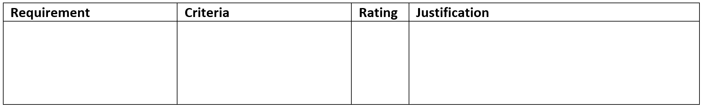
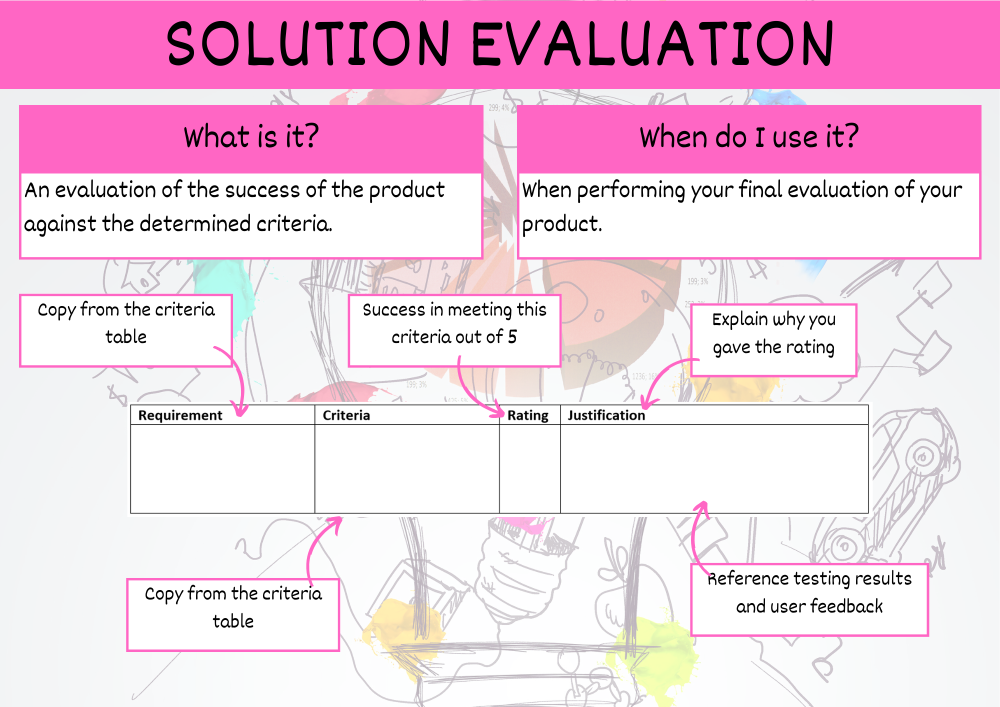

# Solution Evaluation

Steps:

1. Create a solutions evaluation table for prescribed criteria and a second solutions evaluation table for the self-determined criteria.
2. Copy the requirements and criteria established during the Explore phase into the relevant solution evaluation table.
3. Establish are success rating for each criteria.
4. In the recommendations column identify and refinements you made during development of the product as well as any possible future enhancements. **Do not leave this column empty** if you can't think of anything, check the **could** column in the requirements table.

## Summary

