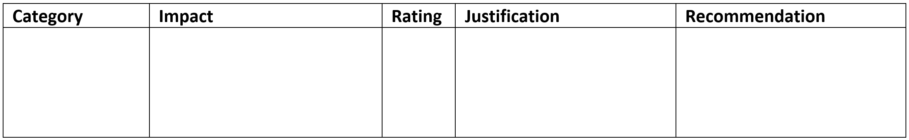
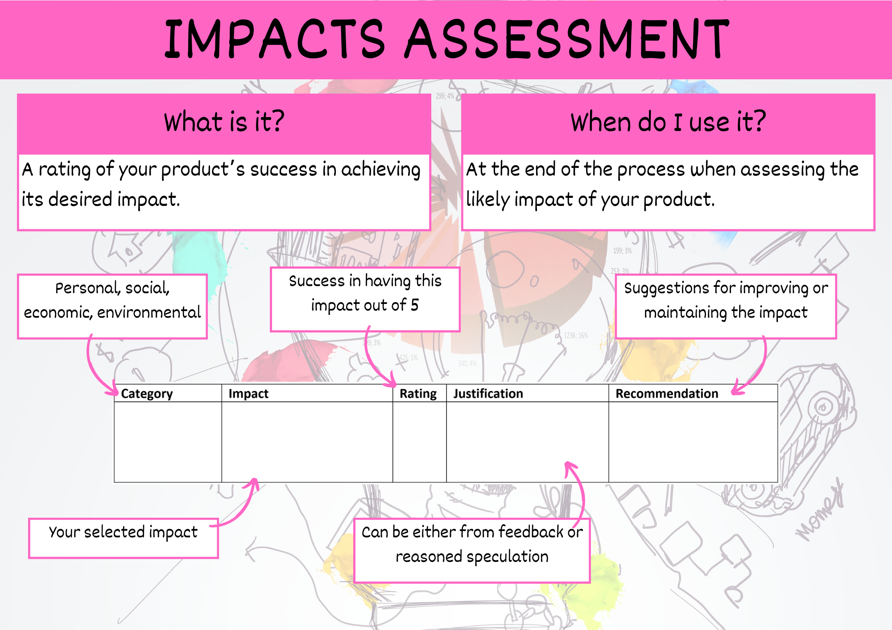

# Impacts Assessment

In the Exploration phase of the EDGE process, you would have identified desired personal, social, economic and environmental impacts. You now need to consider how successful the project has been in achieving these.

This is best done in a table.

## Summary

